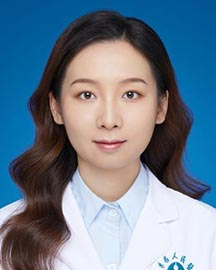

<!-- AUTO-GENERATED-BY: work/generate_obsidian_profiles.py -->

<!-- TEMPLATE: D:\workspace\信息收集整理\医生画像仓库\模板\医生画像模板.md -->

# 王晓霜

## 基础信息

| 字段 | 内容 |
|---|---|
| 姓名 | 王晓霜 |
| 医院 | 广东省人民医院 |
| 科室 | 口腔科门诊 |
| 职称/身份 | 医师 |
| 来源链接 | [官网原文](https://www.gdghospital.org.cn/Expertlistt/info_itemid_47208_subjectid_47.html) |
| 采集日期 | 2026-08-14 |

## 简介/擅长

常见牙周病的诊断和系统治疗

## 教育与进修经历

- 简介 ：口腔医学硕士，毕业于郑州大学牙周病专业。

## 科研项目与成果

- 共发表SCI论文3篇，参与国家级及省部级课题4项，发明专利1项。
- 荣誉奖项 ：获得2023年河南省教育厅科技成果奖一等奖。

## 论文与学术产出

- 共发表SCI论文3篇，参与国家级及省部级课题4项，发明专利1项。

## 可包装亮点

- 现为中华口腔医学会老年口腔专委会会员，广东省口腔医学会会员。
- 共发表SCI论文3篇，参与国家级及省部级课题4项，发明专利1项。
- 荣誉奖项 ：获得2023年河南省教育厅科技成果奖一等奖。

## 重点疾病/人群标签

- 慢性病：
- 肿瘤：
- 生殖疾病：
- 免疫/风湿：
- 术后恢复/康复：
- 疑难重症：复杂

## 证据摘录

> 只摘录官网公开信息中的短句或关键字段，不复制大段原文。

- 官网身份字段：医师
- 官网简介/擅长：常见牙周病的诊断和系统治疗
- 官网亮眼经历线索：现为中华口腔医学会老年口腔专委会会员，广东省口腔医学会会员。 共发表SCI论文3篇，参与国家级及省部级课题4项，发明专利1项。 荣誉奖项 ：获得2023年河南省教育厅科技成果奖一等奖。
- 来源链接：https://www.gdghospital.org.cn/Expertlistt/info_itemid_47208_subjectid_47.html

## BD 画像摘要

王晓霜医生可作为疑难重症方向的基础画像候选。后续 BD 使用应继续以官网来源和人工复核为准，不添加疗效承诺或无来源包装。

## 合规边界

- 仅使用医院官网、官方公众号、官方小程序等公开渠道。
- 不采集私人电话、私人微信、家庭住址、患者隐私或非公开排班信息。
- 不写“保证治愈”“疗效第一”“包治疑难杂症”等无法由官网证明的表述。
