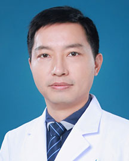

<!-- AUTO-GENERATED-BY: work/generate_obsidian_profiles.py -->

<!-- TEMPLATE: D:\workspace\信息收集整理\医生画像仓库\模板\医生画像模板.md -->

# 王来友

## 基础信息

| 字段 | 内容 |
|---|---|
| 姓名 | 王来友 |
| 医院 | 广东省人民医院 |
| 科室 | 药学部 |
| 职称/身份 | 教授/研究员 |
| 来源链接 | [官网原文](https://www.gdghospital.org.cn/Expertlistt/info_itemid_34514_subjectid_68.html) |
| 采集日期 | 2026-08-14 |

## 简介/擅长

## 教育与进修经历

- 临床药学科副主任（主持工作），教授（研究员），南方医科大学与华南理工大学医学院硕士、博士研究生导师，广东省人民医院博士后合作导师，世界卫生组织任职后备人才库成员（国家卫健委）。
- 2006年中山大学临床药理所毕业，获医学博士学位；

## 科研项目与成果

- 社会职务 ： 中华医学会广东省临床药学分会青年专委会副主任委员 广东省药理学会药品再评价专业委员会主任委员 中国药学会循证药学专业委员会委员 广东省药理学会中药药理专委会副主任委员等 学术成果 ： 主持承担NSFC等课题十余项，发表科研论文80余篇 (含SCI论文50余篇)；
- 获授权中国发明专利五项。
- 国家自然科学基金评审专家，多个SCI杂志审稿人。

## 论文与学术产出

- 社会职务 ： 中华医学会广东省临床药学分会青年专委会副主任委员 广东省药理学会药品再评价专业委员会主任委员 中国药学会循证药学专业委员会委员 广东省药理学会中药药理专委会副主任委员等 学术成果 ： 主持承担NSFC等课题十余项，发表科研论文80余篇 (含SCI论文50余篇)；
- 国家自然科学基金评审专家，多个SCI杂志审稿人。

## 可包装亮点

- 临床药学科副主任（主持工作），教授（研究员），南方医科大学与华南理工大学医学院硕士、博士研究生导师，广东省人民医院博士后合作导师，世界卫生组织任职后备人才库成员（国家卫健委）。
- 曾先后在法国、美国、澳大利亚学习和工作。
- 社会职务 ： 中华医学会广东省临床药学分会青年专委会副主任委员 广东省药理学会药品再评价专业委员会主任委员 中国药学会循证药学专业委员会委员 广东省药理学会中药药理专委会副主任委员等 学术成果 ： 主持承担NSFC等课题十余项，发表科研论文80余篇 (含SCI论文50余篇)；
- 获授权中国发明专利五项。

## 重点疾病/人群标签

- 慢性病：
- 肿瘤：
- 生殖疾病：
- 免疫/风湿：
- 术后恢复/康复：
- 疑难重症：

## 证据摘录

> 只摘录官网公开信息中的短句或关键字段，不复制大段原文。

- 官网身份字段：教授/研究员
- 官网亮眼经历线索：临床药学科副主任（主持工作），教授（研究员），南方医科大学与华南理工大学医学院硕士、博士研究生导师，广东省人民医院博士后合作导师，世界卫生组织任职后备人才库成员（国家卫健委）。 曾先后在法国、美国、澳大利亚学习和工作。 社会职务 ： 中华医学会广东省临床药学分会青年专委会副主任委员 广东省药理学会药品再评价专业委员会主任委员 中国药学会循证药学专业委员会委员 广东省药理学会中药药理专委会副主任委员等 学术成果 ： 主持承担NSFC等课…
- 来源链接：https://www.gdghospital.org.cn/Expertlistt/info_itemid_34514_subjectid_68.html

## BD 画像摘要

王来友医生可作为广东省人民医院药学部的基础医生资料入库。当前重点方向以总底表标签为准，官网未展示的信息保持空白。

## 合规边界

- 仅使用医院官网、官方公众号、官方小程序等公开渠道。
- 不采集私人电话、私人微信、家庭住址、患者隐私或非公开排班信息。
- 不写“保证治愈”“疗效第一”“包治疑难杂症”等无法由官网证明的表述。
