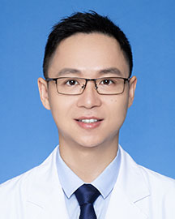

<!-- AUTO-GENERATED-BY: work/generate_obsidian_profiles.py -->

<!-- TEMPLATE: D:\workspace\信息收集整理\医生画像仓库\模板\医生画像模板.md -->

# 田单

## 基础信息

| 字段 | 内容 |
|---|---|
| 姓名 | 田单 |
| 医院 | 广东省人民医院 |
| 科室 | 胸外科 |
| 职称/身份 | 副主任医师 |
| 来源链接 | [官网原文](https://www.gdghospital.org.cn/Expertlistt/info_itemid_32834_subjectid_8.html) |
| 采集日期 | 2026-08-14 |

## 简介/擅长

主要从事肺移植、肺结节、肺癌、食管癌、纵隔肿瘤、漏斗胸、手汗症等胸部常见疾病的诊治，广东省人民医院肺移植团队核心成员，熟练掌握胸腔镜下操作技术，擅长单孔胸腔镜肺癌根治术、全腔镜食管癌根治术、全腔镜纵隔肿瘤切除术、漏斗胸矫治术、胸腔镜交感神经切断术等胸外科微创手术

## 教育与进修经历

- 简介 毕业于北京大学临床医学八年制，曾前往荷兰Erasmus University Rotterdam医学中心访问学习，发表SCI论文二十余篇，主持广东省自然科学基金，广东省医学科学研究基金及广州市基础研究计划项目各一项，拥有国家实用新型专利一项。

## 科研项目与成果

- 简介 毕业于北京大学临床医学八年制，曾前往荷兰Erasmus University Rotterdam医学中心访问学习，发表SCI论文二十余篇，主持广东省自然科学基金，广东省医学科学研究基金及广州市基础研究计划项目各一项，拥有国家实用新型专利一项。

## 论文与学术产出

- 简介 毕业于北京大学临床医学八年制，曾前往荷兰Erasmus University Rotterdam医学中心访问学习，发表SCI论文二十余篇，主持广东省自然科学基金，广东省医学科学研究基金及广州市基础研究计划项目各一项，拥有国家实用新型专利一项。

## 可包装亮点

- 简介 毕业于北京大学临床医学八年制，曾前往荷兰Erasmus University Rotterdam医学中心访问学习，发表SCI论文二十余篇，主持广东省自然科学基金，广东省医学科学研究基金及广州市基础研究计划项目各一项，拥有国家实用新型专利一项。
- 现任广东省药学会胸外科专家委员会常务委员，广东省胸部疾病学会胸部肿瘤微创外科专业委员会常务委员，广东省胸部疾病学会心肺移植专业委员会委员，广州市抗癌协会食管癌专业委员会青年委员，广州市医师协会青年医师分会委员。

## 重点疾病/人群标签

- 慢性病：
- 肿瘤：肿瘤、癌、肺癌
- 生殖疾病：
- 免疫/风湿：
- 术后恢复/康复：
- 疑难重症：

## 证据摘录

> 只摘录官网公开信息中的短句或关键字段，不复制大段原文。

- 官网身份字段：副主任医师
- 官网简介/擅长：主要从事肺移植、肺结节、肺癌、食管癌、纵隔肿瘤、漏斗胸、手汗症等胸部常见疾病的诊治，广东省人民医院肺移植团队核心成员，熟练掌握胸腔镜下操作技术，擅长单孔胸腔镜肺癌根治术、全腔镜食管癌根治术、全腔镜纵隔肿瘤切除术、漏斗胸矫治术、胸腔镜交感神经切断术等胸外科微创手术
- 官网亮眼经历线索：简介 毕业于北京大学临床医学八年制，曾前往荷兰Erasmus University Rotterdam医学中心访问学习，发表SCI论文二十余篇，主持广东省自然科学基金，广东省医学科学研究基金及广州市基础研究计划项目各一项，拥有国家实用新型专利一项。 现任广东省药学会胸外科专家委员会常务委员，广东省胸部疾病学会胸部肿瘤微创外科专业委员会常务委员，广东省胸部疾病学会心肺移植专业委员会委员，广州市抗癌协会食管癌专业委员会青年委员，广州市医师…
- 来源链接：https://www.gdghospital.org.cn/Expertlistt/info_itemid_32834_subjectid_8.html

## BD 画像摘要

田单医生可作为肿瘤方向的基础画像候选。后续 BD 使用应继续以官网来源和人工复核为准，不添加疗效承诺或无来源包装。

## 合规边界

- 仅使用医院官网、官方公众号、官方小程序等公开渠道。
- 不采集私人电话、私人微信、家庭住址、患者隐私或非公开排班信息。
- 不写“保证治愈”“疗效第一”“包治疑难杂症”等无法由官网证明的表述。
