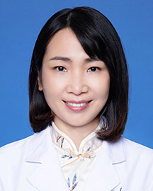

<!-- AUTO-GENERATED-BY: work/generate_obsidian_profiles.py -->

<!-- TEMPLATE: D:\workspace\信息收集整理\医生画像仓库\模板\医生画像模板.md -->

# 盛晓丽

## 基础信息

| 字段 | 内容 |
|---|---|
| 姓名 | 盛晓丽 |
| 医院 | 广东省人民医院 |
| 科室 | 咽喉头颈外科 |
| 职称/身份 | 副主任医师 |
| 来源链接 | [官网原文](https://www.gdghospital.org.cn/Expertlistt/info_itemid_24953_subjectid_45.html) |
| 采集日期 | 2026-08-14 |

## 简介/擅长

## 教育与进修经历

- 曾在美国斯坦福大学做一年访问学者。

## 科研项目与成果

- 专业特长： （1）头部颈部肿块 （2）头颈部先天性疾病：淋巴管瘤，血管瘤，先天性鳃裂畸形，甲状舌管囊瘘，耳前瘘管等 （3）甲状（旁）腺肿瘤：结节性甲状腺肿，甲状腺癌，甲状旁腺腺瘤等 （4）腮腺肿瘤：腮腺混合瘤，腮腺腺淋巴瘤等 （5）咽喉部疾病：咽喉炎，咽喉部乳头状瘤，声带囊肿，声带息肉，声带肿瘤等 （6）成人及小儿鼾症 在国内外杂志发表10余篇学术论文，主持或参与多项省级、国家级科研。

## 论文与学术产出

- 专业特长： （1）头部颈部肿块 （2）头颈部先天性疾病：淋巴管瘤，血管瘤，先天性鳃裂畸形，甲状舌管囊瘘，耳前瘘管等 （3）甲状（旁）腺肿瘤：结节性甲状腺肿，甲状腺癌，甲状旁腺腺瘤等 （4）腮腺肿瘤：腮腺混合瘤，腮腺腺淋巴瘤等 （5）咽喉部疾病：咽喉炎，咽喉部乳头状瘤，声带囊肿，声带息肉，声带肿瘤等 （6）成人及小儿鼾症 在国内外杂志发表10余篇学术论文，主持或参与多项省级、国家级科研。

## 可包装亮点

- 曾在美国斯坦福大学做一年访问学者。
- 专业特长： （1）头部颈部肿块 （2）头颈部先天性疾病：淋巴管瘤，血管瘤，先天性鳃裂畸形，甲状舌管囊瘘，耳前瘘管等 （3）甲状（旁）腺肿瘤：结节性甲状腺肿，甲状腺癌，甲状旁腺腺瘤等 （4）腮腺肿瘤：腮腺混合瘤，腮腺腺淋巴瘤等 （5）咽喉部疾病：咽喉炎，咽喉部乳头状瘤，声带囊肿，声带息肉，声带肿瘤等 （6）成人及小儿鼾症 在国内外杂志发表10余篇学术论文，主…
- 主要学术任职： 广东省医学会睡眠分会 常委 广东省中西医结合学会嗓音分会 委员 广东省医学会耳鼻咽喉分会咽喉学组委员 中妇幼协会儿童耳鼻喉微创学组青年委员

## 重点疾病/人群标签

- 慢性病：
- 肿瘤：肿瘤、癌、瘤、淋巴瘤
- 生殖疾病：
- 免疫/风湿：
- 术后恢复/康复：
- 疑难重症：

## 证据摘录

> 只摘录官网公开信息中的短句或关键字段，不复制大段原文。

- 官网身份字段：副主任医师
- 官网亮眼经历线索：曾在美国斯坦福大学做一年访问学者。 专业特长： （1）头部颈部肿块 （2）头颈部先天性疾病：淋巴管瘤，血管瘤，先天性鳃裂畸形，甲状舌管囊瘘，耳前瘘管等 （3）甲状（旁）腺肿瘤：结节性甲状腺肿，甲状腺癌，甲状旁腺腺瘤等 （4）腮腺肿瘤：腮腺混合瘤，腮腺腺淋巴瘤等 （5）咽喉部疾病：咽喉炎，咽喉部乳头状瘤，声带囊肿，声带息肉，声带肿瘤等 （6）成人及小儿鼾症 在国内外杂志发表10余篇学术论文，主持或参与多项省级、国家级科研。 主要学术任职…
- 来源链接：https://www.gdghospital.org.cn/Expertlistt/info_itemid_24953_subjectid_45.html

## BD 画像摘要

盛晓丽医生可作为肿瘤方向的基础画像候选。后续 BD 使用应继续以官网来源和人工复核为准，不添加疗效承诺或无来源包装。

## 合规边界

- 仅使用医院官网、官方公众号、官方小程序等公开渠道。
- 不采集私人电话、私人微信、家庭住址、患者隐私或非公开排班信息。
- 不写“保证治愈”“疗效第一”“包治疑难杂症”等无法由官网证明的表述。
