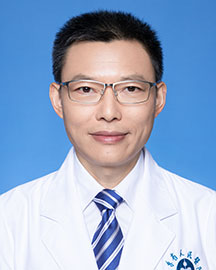

<!-- AUTO-GENERATED-BY: work/generate_obsidian_profiles.py -->

<!-- TEMPLATE: D:\workspace\信息收集整理\医生画像仓库\模板\医生画像模板.md -->

# 石华

## 基础信息

| 字段 | 内容 |
|---|---|
| 姓名 | 石华 |
| 医院 | 广东省人民医院 |
| 科室 | 生殖医学科 |
| 职称/身份 | 副主任医师 |
| 来源链接 | [官网原文](https://www.gdghospital.org.cn/Expertlistt/info_itemid_24854_subjectid_53.html) |
| 采集日期 | 2026-08-14 |

## 简介/擅长

于男性不育、男性性功能障碍、精索静脉曲张、前列腺疾病（前列腺炎、良性前列腺增生）、男性外生殖器畸形、生殖系统肿瘤等男科疾病的诊断和微创治疗

## 教育与进修经历

- 医学博士 分别在中山大学和南方医科大学获得硕士及博士学位，曾到美国维克森林大学做访问学者1年。

## 科研项目与成果

- 近年来主持省级医学课题2项，参加省级科研项目4项，发表泌尿男科专业论文10余篇，其中SCI 3篇。

## 论文与学术产出

- 近年来主持省级医学课题2项，参加省级科研项目4项，发表泌尿男科专业论文10余篇，其中SCI 3篇。

## 可包装亮点

- 医学博士 分别在中山大学和南方医科大学获得硕士及博士学位，曾到美国维克森林大学做访问学者1年。
- 现任广东省医学会男科学分会委员、广东省性学会委员、广州市医学会男科学分会副主任委员。
- 近年来主持省级医学课题2项，参加省级科研项目4项，发表泌尿男科专业论文10余篇，其中SCI 3篇。

## 重点疾病/人群标签

- 慢性病：
- 肿瘤：肿瘤、生殖、功能障碍
- 生殖疾病：肿瘤、生殖、功能障碍
- 免疫/风湿：
- 术后恢复/康复：肿瘤、生殖、功能障碍
- 疑难重症：

## 证据摘录

> 只摘录官网公开信息中的短句或关键字段，不复制大段原文。

- 官网身份字段：副主任医师
- 官网简介/擅长：于男性不育、男性性功能障碍、精索静脉曲张、前列腺疾病（前列腺炎、良性前列腺增生）、男性外生殖器畸形、生殖系统肿瘤等男科疾病的诊断和微创治疗
- 官网亮眼经历线索：医学博士 分别在中山大学和南方医科大学获得硕士及博士学位，曾到美国维克森林大学做访问学者1年。 现任广东省医学会男科学分会委员、广东省性学会委员、广州市医学会男科学分会副主任委员。 近年来主持省级医学课题2项，参加省级科研项目4项，发表泌尿男科专业论文10余篇，其中SCI 3篇。
- 来源链接：https://www.gdghospital.org.cn/Expertlistt/info_itemid_24854_subjectid_53.html

## BD 画像摘要

石华医生可作为肿瘤、生殖疾病、术后恢复/康复方向的基础画像候选。后续 BD 使用应继续以官网来源和人工复核为准，不添加疗效承诺或无来源包装。

## 合规边界

- 仅使用医院官网、官方公众号、官方小程序等公开渠道。
- 不采集私人电话、私人微信、家庭住址、患者隐私或非公开排班信息。
- 不写“保证治愈”“疗效第一”“包治疑难杂症”等无法由官网证明的表述。
