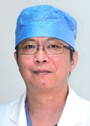

<!-- AUTO-GENERATED-BY: work/generate_obsidian_profiles.py -->

<!-- TEMPLATE: D:\workspace\信息收集整理\医生画像仓库\模板\医生画像模板.md -->

# 章晓华

## 基础信息

| 字段 | 内容 |
|---|---|
| 姓名 | 章晓华 |
| 医院 | 广东省人民医院 |
| 科室 | 心外科 |
| 职称/身份 | 主任医师 |
| 来源链接 | [官网原文](https://www.gdghospital.org.cn/Expertlistt/info_itemid_24354_subjectid_80.html) |
| 采集日期 | 2026-08-14 |

## 简介/擅长

各种先心病、瓣膜病、冠状动脉搭桥、大血管心脏直视手术的体外循环及ECMO循环及呼吸辅助临床工作

## 教育与进修经历

- 医学博士 1986年毕业于中山医科大学， 2002年2月至7月以访问学者身份到美国哈佛大学医学院麻省总医院及波士顿儿童医院交流学习。

## 科研项目与成果

- 参加 “十一五”、“十二五” 国家科技支撑计划课题的研究，获广东省科技进步二等奖1次。

## 论文与学术产出

- 在冠状动脉搭桥、心脏瓣膜置换、大血管手术、小儿体外循环、心肌保护、ECMO循环及呼吸辅助、体外循环职业教育等多方面发表学术论文二十多篇。

## 可包装亮点

- 医学博士 1986年毕业于中山医科大学， 2002年2月至7月以访问学者身份到美国哈佛大学医学院麻省总医院及波士顿儿童医院交流学习。
- 中国生物医学工程学会体外循环分会副主任委员，中国食品药品监督总局全国医用体外循环设备标准化技术委员会委员，中华医学会胸心血管外科学分会体外循环学组副组长，广东省医学会胸心外科学分会委员，广东省生物医学工程学会委员；
- 在冠状动脉搭桥、心脏瓣膜置换、大血管手术、小儿体外循环、心肌保护、ECMO循环及呼吸辅助、体外循环职业教育等多方面发表学术论文二十多篇。
- 参加 “十一五”、“十二五” 国家科技支撑计划课题的研究，获广东省科技进步二等奖1次。

## 重点疾病/人群标签

- 慢性病：
- 肿瘤：
- 生殖疾病：
- 免疫/风湿：
- 术后恢复/康复：
- 疑难重症：

## 证据摘录

> 只摘录官网公开信息中的短句或关键字段，不复制大段原文。

- 官网身份字段：主任医师
- 官网简介/擅长：各种先心病、瓣膜病、冠状动脉搭桥、大血管心脏直视手术的体外循环及ECMO循环及呼吸辅助临床工作
- 官网亮眼经历线索：医学博士 1986年毕业于中山医科大学， 2002年2月至7月以访问学者身份到美国哈佛大学医学院麻省总医院及波士顿儿童医院交流学习。 中国生物医学工程学会体外循环分会副主任委员，中国食品药品监督总局全国医用体外循环设备标准化技术委员会委员，中华医学会胸心血管外科学分会体外循环学组副组长，广东省医学会胸心外科学分会委员，广东省生物医学工程学会委员； 在冠状动脉搭桥、心脏瓣膜置换、大血管手术、小儿体外循环、心肌保护、ECMO循环及呼吸辅助…
- 来源链接：https://www.gdghospital.org.cn/Expertlistt/info_itemid_24354_subjectid_80.html

## BD 画像摘要

章晓华医生可作为广东省人民医院心外科的基础医生资料入库。当前重点方向以总底表标签为准，官网未展示的信息保持空白。

## 合规边界

- 仅使用医院官网、官方公众号、官方小程序等公开渠道。
- 不采集私人电话、私人微信、家庭住址、患者隐私或非公开排班信息。
- 不写“保证治愈”“疗效第一”“包治疑难杂症”等无法由官网证明的表述。
