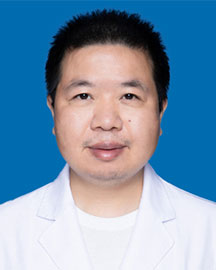

<!-- AUTO-GENERATED-BY: work/generate_obsidian_profiles.py -->

<!-- TEMPLATE: D:\workspace\信息收集整理\医生画像仓库\模板\医生画像模板.md -->

# 管吉林

## 基础信息

| 字段 | 内容 |
|---|---|
| 姓名 | 管吉林 |
| 医院 | 广东省人民医院 |
| 科室 | 肿瘤日间病区 |
| 职称/身份 | 主治医师 |
| 来源链接 | [官网原文](https://www.gdghospital.org.cn/Expertlistt/info_itemid_33925_subjectid_28.html) |
| 采集日期 | 2026-08-14 |

## 简介/擅长

肺癌 的精准及规范治疗，对于 KRAS 突变肺癌的精准治疗有较为深刻的研究

## 论文与学术产出

- 2012 年 7 月进入肿瘤中心工作，主攻头颈部肿瘤的治疗，熟练掌握头颈部肿 瘤如鼻咽，喉及下咽癌的规范治疗，作为第一及共同作者发表多篇 SCI 论文 ;

## 可包装亮点

- 2009 年 9 月在广东省人民医院肺研所攻读硕士，师从吴一龙教师，主攻肺癌 的精准及规范治疗，对于 KRAS 突变肺癌的精准治疗有较为深刻的研究。
- 2012 年 7 月进入肿瘤中心工作，主攻头颈部肿瘤的治疗，熟练掌握头颈部肿 瘤如鼻咽，喉及下咽癌的规范治疗，作为第一及共同作者发表多篇 SCI 论文 ;
- 擅长：1. 熟练掌握肺癌的规范治疗，对于肺癌个体精准的治疗，特别对于 KRAS 突变的肺癌有较好的研究；

## 重点疾病/人群标签

- 慢性病：
- 肿瘤：肿瘤、癌、瘤、鼻咽癌、肺癌
- 生殖疾病：
- 免疫/风湿：
- 术后恢复/康复：
- 疑难重症：

## 证据摘录

> 只摘录官网公开信息中的短句或关键字段，不复制大段原文。

- 官网身份字段：主治医师
- 官网简介/擅长：肺癌 的精准及规范治疗，对于 KRAS 突变肺癌的精准治疗有较为深刻的研究
- 官网亮眼经历线索：2009 年 9 月在广东省人民医院肺研所攻读硕士，师从吴一龙教师，主攻肺癌 的精准及规范治疗，对于 KRAS 突变肺癌的精准治疗有较为深刻的研究。 2012 年 7 月进入肿瘤中心工作，主攻头颈部肿瘤的治疗，熟练掌握头颈部肿 瘤如鼻咽，喉及下咽癌的规范治疗，作为第一及共同作者发表多篇 SCI 论文 ; 擅长：1. 熟练掌握肺癌的规范治疗，对于肺癌个体精准的治疗，特别对于 KRAS 突变的肺癌有较好的研究；
- 来源链接：https://www.gdghospital.org.cn/Expertlistt/info_itemid_33925_subjectid_28.html

## BD 画像摘要

管吉林医生可作为肿瘤方向的基础画像候选。后续 BD 使用应继续以官网来源和人工复核为准，不添加疗效承诺或无来源包装。

## 合规边界

- 仅使用医院官网、官方公众号、官方小程序等公开渠道。
- 不采集私人电话、私人微信、家庭住址、患者隐私或非公开排班信息。
- 不写“保证治愈”“疗效第一”“包治疑难杂症”等无法由官网证明的表述。
