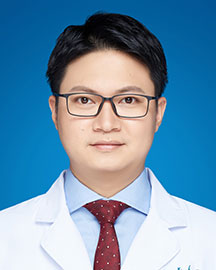

<!-- AUTO-GENERATED-BY: work/generate_obsidian_profiles.py -->

<!-- TEMPLATE: D:\workspace\信息收集整理\医生画像仓库\模板\医生画像模板.md -->

# 罗子寰

## 基础信息

| 字段 | 内容 |
|---|---|
| 姓名 | 罗子寰 |
| 医院 | 广东省人民医院 |
| 科室 | 肾移植科 |
| 职称/身份 | 主治医师 |
| 来源链接 | [官网原文](https://www.gdghospital.org.cn/Expertlistt/info_itemid_32781_subjectid_108.html) |
| 采集日期 | 2026-08-14 |

## 简介/擅长

肾移植手术术前评估咨询，对肾移植患者术中及术后的康复管理具有丰富经验，致力于肾移植手术并发症、术后移植肾排斥、病毒感染和肺部感染等治疗，长期跟踪随访肾移植术后患者

## 论文与学术产出

- 专注移植免疫相关的临床科学研究，发表数篇高质量学术论文。

## 可包装亮点

- 科室骨干 广东省泌尿生殖协会肾脏移植学分会 委员 中山大学临床医学博士，从事肾移植工作多年，参与肾移植手术100余台；
- 专注移植免疫相关的临床科学研究，发表数篇高质量学术论文。

## 重点疾病/人群标签

- 慢性病：
- 肿瘤：
- 生殖疾病：生殖、免疫、感染、术后、康复
- 免疫/风湿：生殖、免疫、感染、术后、康复
- 术后恢复/康复：生殖、免疫、感染、术后、康复
- 疑难重症：

## 证据摘录

> 只摘录官网公开信息中的短句或关键字段，不复制大段原文。

- 官网身份字段：主治医师
- 官网简介/擅长：肾移植手术术前评估咨询，对肾移植患者术中及术后的康复管理具有丰富经验，致力于肾移植手术并发症、术后移植肾排斥、病毒感染和肺部感染等治疗，长期跟踪随访肾移植术后患者
- 官网亮眼经历线索：科室骨干 广东省泌尿生殖协会肾脏移植学分会 委员 中山大学临床医学博士，从事肾移植工作多年，参与肾移植手术100余台； 专注移植免疫相关的临床科学研究，发表数篇高质量学术论文。
- 来源链接：https://www.gdghospital.org.cn/Expertlistt/info_itemid_32781_subjectid_108.html

## BD 画像摘要

罗子寰医生可作为生殖疾病、免疫/风湿/感染、术后恢复/康复方向的基础画像候选。后续 BD 使用应继续以官网来源和人工复核为准，不添加疗效承诺或无来源包装。

## 合规边界

- 仅使用医院官网、官方公众号、官方小程序等公开渠道。
- 不采集私人电话、私人微信、家庭住址、患者隐私或非公开排班信息。
- 不写“保证治愈”“疗效第一”“包治疑难杂症”等无法由官网证明的表述。
