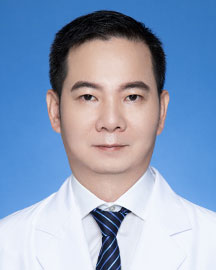

<!-- AUTO-GENERATED-BY: work/generate_obsidian_profiles.py -->

<!-- TEMPLATE: D:\workspace\信息收集整理\医生画像仓库\模板\医生画像模板.md -->

# 罗小宁

## 基础信息

| 字段 | 内容 |
|---|---|
| 姓名 | 罗小宁 |
| 医院 | 广东省人民医院 |
| 科室 | 咽喉头颈外科 |
| 职称/身份 | 主任医师 |
| 来源链接 | [官网原文](https://www.gdghospital.org.cn/Expertlistt/info_itemid_24942_subjectid_45.html) |
| 采集日期 | 2026-08-14 |

## 简介/擅长

以下头颈肿瘤的诊断和治疗: 颈部肿块、咽喉肿瘤、甲状腺肿瘤、鼻咽癌、鼻腔鼻窦肿瘤、涎腺肿瘤等

## 教育与进修经历

- 广东省人民医院耳鼻咽喉头颈外科 主任医师 美国安德森癌症中心及丹麦欧登塞大学头颈外科访问学者。

## 科研项目与成果

- 在国内外杂志发表20余篇学术论文，主持或参与多项省级、国家级科研。

## 论文与学术产出

- 在国内外杂志发表20余篇学术论文，主持或参与多项省级、国家级科研。

## 可包装亮点

- 广东省人民医院耳鼻咽喉头颈外科 主任医师 美国安德森癌症中心及丹麦欧登塞大学头颈外科访问学者。
- 从事咽喉头颈外科工作20余年，具备良好的理论基础和临床经验，熟练掌握本专业常见病、多发病的诊治，对疑难病例具有较为丰富的临床经验。
- 在国内外杂志发表20余篇学术论文，主持或参与多项省级、国家级科研。
- 主要学术任职 ： 广东省医师协会头颈肿瘤分会常委；

## 重点疾病/人群标签

- 慢性病：
- 肿瘤：肿瘤、癌、鼻咽癌、疑难
- 生殖疾病：
- 免疫/风湿：
- 术后恢复/康复：
- 疑难重症：肿瘤、癌、鼻咽癌、疑难

## 证据摘录

> 只摘录官网公开信息中的短句或关键字段，不复制大段原文。

- 官网身份字段：主任医师
- 官网简介/擅长：以下头颈肿瘤的诊断和治疗: 颈部肿块、咽喉肿瘤、甲状腺肿瘤、鼻咽癌、鼻腔鼻窦肿瘤、涎腺肿瘤等
- 官网亮眼经历线索：广东省人民医院耳鼻咽喉头颈外科 主任医师 美国安德森癌症中心及丹麦欧登塞大学头颈外科访问学者。 从事咽喉头颈外科工作20余年，具备良好的理论基础和临床经验，熟练掌握本专业常见病、多发病的诊治，对疑难病例具有较为丰富的临床经验。 在国内外杂志发表20余篇学术论文，主持或参与多项省级、国家级科研。 主要学术任职 ： 广东省医师协会头颈肿瘤分会常委；
- 来源链接：https://www.gdghospital.org.cn/Expertlistt/info_itemid_24942_subjectid_45.html

## BD 画像摘要

罗小宁医生可作为肿瘤、疑难重症方向的基础画像候选。后续 BD 使用应继续以官网来源和人工复核为准，不添加疗效承诺或无来源包装。

## 合规边界

- 仅使用医院官网、官方公众号、官方小程序等公开渠道。
- 不采集私人电话、私人微信、家庭住址、患者隐私或非公开排班信息。
- 不写“保证治愈”“疗效第一”“包治疑难杂症”等无法由官网证明的表述。
