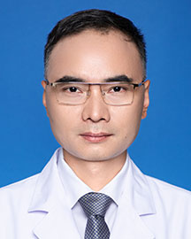

<!-- AUTO-GENERATED-BY: work/generate_obsidian_profiles.py -->

<!-- TEMPLATE: D:\workspace\信息收集整理\医生画像仓库\模板\医生画像模板.md -->

# 罗少华

## 基础信息

| 字段 | 内容 |
|---|---|
| 姓名 | 罗少华 |
| 医院 | 广东省人民医院 |
| 科室 | 呼吸与危重症医学科 |
| 职称/身份 | 主任医师 |
| 来源链接 | [官网原文](https://www.gdghospital.org.cn/Expertlistt/info_itemid_25398_subjectid_19.html) |
| 采集日期 | 2026-08-14 |

## 简介/擅长

睡眠呼吸暂停及肺部肿瘤的以经气管镜介入为主的综合治疗

## 科研项目与成果

- 主持或参与国家级或省级课题数项，发表论文十余篇。

## 论文与学术产出

- 主持或参与国家级或省级课题数项，发表论文十余篇。

## 可包装亮点

- 医学博士 广东省临床医师协会肺血管及介入专委会常委 广东省基层医药学会肺癌专委会常委 中国医师协会睡眠医学分会委员 中国呼吸肿瘤协作组南区（泛大湾区呼吸肿瘤联盟）委员 广东省精准医学应用学会抗感染分会委员 从事呼吸专科临床工作多年，对于肺部阴影、肺部占位、淋巴结肿大等常见征象和体征，具有敏锐的鉴别能力，熟练掌握呼吸科常见疾病（如肺炎、哮喘、支气管扩张剂、慢…
- 主持或参与国家级或省级课题数项，发表论文十余篇。

## 重点疾病/人群标签

- 慢性病：慢性、肿瘤、肺癌、感染、危重
- 肿瘤：慢性、肿瘤、肺癌、感染、危重
- 生殖疾病：
- 免疫/风湿：慢性、肿瘤、肺癌、感染、危重
- 术后恢复/康复：
- 疑难重症：慢性、肿瘤、肺癌、感染、危重

## 证据摘录

> 只摘录官网公开信息中的短句或关键字段，不复制大段原文。

- 官网身份字段：主任医师
- 官网简介/擅长：睡眠呼吸暂停及肺部肿瘤的以经气管镜介入为主的综合治疗
- 官网亮眼经历线索：医学博士 广东省临床医师协会肺血管及介入专委会常委 广东省基层医药学会肺癌专委会常委 中国医师协会睡眠医学分会委员 中国呼吸肿瘤协作组南区（泛大湾区呼吸肿瘤联盟）委员 广东省精准医学应用学会抗感染分会委员 从事呼吸专科临床工作多年，对于肺部阴影、肺部占位、淋巴结肿大等常见征象和体征，具有敏锐的鉴别能力，熟练掌握呼吸科常见疾病（如肺炎、哮喘、支气管扩张剂、慢性阻塞性肺疾病、肺气肿、肺部肿瘤、气胸、间质性肺病等）的诊治，擅长睡眠呼吸暂停及…
- 来源链接：https://www.gdghospital.org.cn/Expertlistt/info_itemid_25398_subjectid_19.html

## BD 画像摘要

罗少华医生可作为慢性病、肿瘤、免疫/风湿/感染、疑难重症方向的基础画像候选。后续 BD 使用应继续以官网来源和人工复核为准，不添加疗效承诺或无来源包装。

## 合规边界

- 仅使用医院官网、官方公众号、官方小程序等公开渠道。
- 不采集私人电话、私人微信、家庭住址、患者隐私或非公开排班信息。
- 不写“保证治愈”“疗效第一”“包治疑难杂症”等无法由官网证明的表述。
