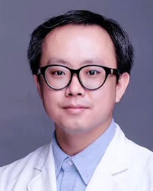

<!-- AUTO-GENERATED-BY: work/generate_obsidian_profiles.py -->

<!-- TEMPLATE: D:\workspace\信息收集整理\医生画像仓库\模板\医生画像模板.md -->

# 罗陆侨

## 基础信息

| 字段 | 内容 |
|---|---|
| 姓名 | 罗陆侨 |
| 医院 | 广东省人民医院 |
| 科室 | 病理科 |
| 职称/身份 | 副主任技师 |
| 来源链接 | [官网原文](https://www.gdghospital.org.cn/Expertlistt/info_itemid_55556_subjectid_59.html) |
| 采集日期 | 2026-08-14 |

## 简介/擅长

掌握免疫组化技术及质控 以第一作者发表SCI论文2篇和中文核心期刊2篇 主持广东省医学科研基金1项 参与国家自然科学基金委员会面上项目1项 广东省基层医药学会病理学专业委员会 常务委员兼秘书 中国抗癌协会肿瘤病理专业委员会 会员 广东省抗癌协会肿瘤病理专业委员会 会员 赣州市保健学会病理分会 技术顾问 ISO15189医学实验室认可内审员 2022年4月～2023年4月在江西省赣州市龙南市第一人民医院病理科帮扶

## 科研项目与成果

- 广东省人民医院病理科免疫组化组组长 主管技师 从事临床病理技术工作15年，熟悉掌握免疫组化技术及质控 以第一作者发表SCI论文2篇和中文核心期刊2篇 主持广东省医学科研基金1项 参与国家自然科学基金委员会面上项目1项 广东省基层医药学会病理学专业委员会 常务委员兼秘书 中国抗癌协会肿瘤病理专业委员会 会员 广东省抗癌协会肿瘤病理专业委员会 会员 赣州市保健学会病理分会 技术顾问 ISO15189医学实验室认可内审员 2022年4月～2023年4月在江西省赣州市龙南市第一人民医院病理科帮扶。

## 论文与学术产出

- 广东省人民医院病理科免疫组化组组长 主管技师 从事临床病理技术工作15年，熟悉掌握免疫组化技术及质控 以第一作者发表SCI论文2篇和中文核心期刊2篇 主持广东省医学科研基金1项 参与国家自然科学基金委员会面上项目1项 广东省基层医药学会病理学专业委员会 常务委员兼秘书 中国抗癌协会肿瘤病理专业委员会 会员 广东省抗癌协会肿瘤病理专业委员会 会员 赣州市保健学会病理分会 技术顾问 ISO15189医学实验室认可内审员 2022年4月～2023年4月在江西省赣州市龙南市第一人民医院病理科帮扶。

## 可包装亮点

- 广东省人民医院病理科免疫组化组组长 主管技师 从事临床病理技术工作15年，熟悉掌握免疫组化技术及质控 以第一作者发表SCI论文2篇和中文核心期刊2篇 主持广东省医学科研基金1项 参与国家自然科学基金委员会面上项目1项 广东省基层医药学会病理学专业委员会 常务委员兼秘书 中国抗癌协会肿瘤病理专业委员会 会员 广东省抗癌协会肿瘤病理专业委员会 会员 赣州市保健…

## 重点疾病/人群标签

- 慢性病：
- 肿瘤：肿瘤、癌、免疫
- 生殖疾病：
- 免疫/风湿：肿瘤、癌、免疫
- 术后恢复/康复：
- 疑难重症：

## 证据摘录

> 只摘录官网公开信息中的短句或关键字段，不复制大段原文。

- 官网身份字段：副主任技师
- 官网简介/擅长：掌握免疫组化技术及质控 以第一作者发表SCI论文2篇和中文核心期刊2篇 主持广东省医学科研基金1项 参与国家自然科学基金委员会面上项目1项 广东省基层医药学会病理学专业委员会 常务委员兼秘书 中国抗癌协会肿瘤病理专业委员会 会员 广东省抗癌协会肿瘤病理专业委员会 会员 赣州市保健学会病理分会 技术顾问 ISO15189医学实验室认可内审员 2022年4月～2023年4月在江西省赣州市龙南市第一人民医院病理科帮扶
- 官网亮眼经历线索：广东省人民医院病理科免疫组化组组长 主管技师 从事临床病理技术工作15年，熟悉掌握免疫组化技术及质控 以第一作者发表SCI论文2篇和中文核心期刊2篇 主持广东省医学科研基金1项 参与国家自然科学基金委员会面上项目1项 广东省基层医药学会病理学专业委员会 常务委员兼秘书 中国抗癌协会肿瘤病理专业委员会 会员 广东省抗癌协会肿瘤病理专业委员会 会员 赣州市保健学会病理分会 技术顾问 ISO15189医学实验室认可内审员 2022年4月～2…
- 来源链接：https://www.gdghospital.org.cn/Expertlistt/info_itemid_55556_subjectid_59.html

## BD 画像摘要

罗陆侨医生可作为肿瘤、免疫/风湿/感染方向的基础画像候选。后续 BD 使用应继续以官网来源和人工复核为准，不添加疗效承诺或无来源包装。

## 合规边界

- 仅使用医院官网、官方公众号、官方小程序等公开渠道。
- 不采集私人电话、私人微信、家庭住址、患者隐私或非公开排班信息。
- 不写“保证治愈”“疗效第一”“包治疑难杂症”等无法由官网证明的表述。
