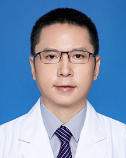

<!-- AUTO-GENERATED-BY: work/generate_obsidian_profiles.py -->

<!-- TEMPLATE: D:\workspace\信息收集整理\医生画像仓库\模板\医生画像模板.md -->

# 聂强

## 基础信息

| 字段 | 内容 |
|---|---|
| 姓名 | 聂强 |
| 医院 | 广东省人民医院 |
| 科室 | 肺外科 |
| 职称/身份 | 副主任医师 |
| 来源链接 | [官网原文](https://www.gdghospital.org.cn/Expertlistt/info_itemid_25038_subjectid_25.html) |
| 采集日期 | 2026-08-14 |

## 简介/擅长

## 教育与进修经历

- 博士后 从事外科临床工作十余年，熟练掌握胸部肿瘤外科疾病的诊断和治疗。
- 先后主持博士后基金，广东省自然科学基金及国家自然科学基金（面上项目）各一项。

## 科研项目与成果

- 先后主持博士后基金，广东省自然科学基金及国家自然科学基金（面上项目）各一项。

## 论文与学术产出

- 在国内外核心期刊上发表学术论文20余篇， 其中SCI、Mediline收录的学术论文5篇。

## 可包装亮点

- 主要关注肺癌以外科为主的多学科综合治疗和相关分子标志物的研究。
- 在国内外核心期刊上发表学术论文20余篇， 其中SCI、Mediline收录的学术论文5篇。
- 先后主持博士后基金，广东省自然科学基金及国家自然科学基金（面上项目）各一项。

## 重点疾病/人群标签

- 慢性病：
- 肿瘤：肿瘤、肺癌、多学科
- 生殖疾病：
- 免疫/风湿：
- 术后恢复/康复：
- 疑难重症：肿瘤、肺癌、多学科

## 证据摘录

> 只摘录官网公开信息中的短句或关键字段，不复制大段原文。

- 官网身份字段：副主任医师
- 官网亮眼经历线索：主要关注肺癌以外科为主的多学科综合治疗和相关分子标志物的研究。 在国内外核心期刊上发表学术论文20余篇， 其中SCI、Mediline收录的学术论文5篇。 先后主持博士后基金，广东省自然科学基金及国家自然科学基金（面上项目）各一项。
- 来源链接：https://www.gdghospital.org.cn/Expertlistt/info_itemid_25038_subjectid_25.html

## BD 画像摘要

聂强医生可作为肿瘤、疑难重症方向的基础画像候选。后续 BD 使用应继续以官网来源和人工复核为准，不添加疗效承诺或无来源包装。

## 合规边界

- 仅使用医院官网、官方公众号、官方小程序等公开渠道。
- 不采集私人电话、私人微信、家庭住址、患者隐私或非公开排班信息。
- 不写“保证治愈”“疗效第一”“包治疑难杂症”等无法由官网证明的表述。
