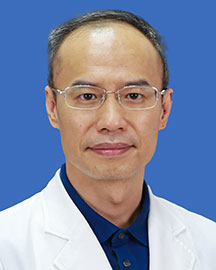

<!-- AUTO-GENERATED-BY: work/generate_obsidian_profiles.py -->

<!-- TEMPLATE: D:\workspace\信息收集整理\医生画像仓库\模板\医生画像模板.md -->

# 肖丹

## 基础信息

| 字段 | 内容 |
|---|---|
| 姓名 | 肖丹 |
| 医院 | 广东省人民医院 |
| 科室 | 脊柱外科 |
| 职称/身份 | 主任医师 |
| 来源链接 | [官网原文](https://www.gdghospital.org.cn/Expertlistt/info_itemid_24309_subjectid_48.html) |
| 采集日期 | 2026-08-14 |

## 简介/擅长

## 教育与进修经历

- 医学博士 中山医科大学临床医学系毕业，著名国际脊柱学术组织AOSpine会员。
- 从事脊柱外科临床工作多年，积累丰富的脊柱疾病诊治经验，从事脊柱外科临床工作多年，积累丰富的脊柱脊髓疾病诊治经验，多次到国内外著名的脊柱外科中心进修学习，具有先进的精准微创治疗理念，常规开展推广脊柱外科新技术，专注脊柱脊髓显微、微创手术及多学科团队治疗各种脊柱畸形，如脊柱微创融合技术、脊柱畸形三维矫正技术、脊柱内镜技术，显微镜下脊柱脊髓手术，国内率先使用微创肌间隙入路腰椎融合手术、改良颈椎后路微创单开门手术，具有费用低创伤小的特点，发表多篇论文，拥有多项医疗器械发明专利。

## 科研项目与成果

- 从事脊柱外科临床工作多年，积累丰富的脊柱疾病诊治经验，从事脊柱外科临床工作多年，积累丰富的脊柱脊髓疾病诊治经验，多次到国内外著名的脊柱外科中心进修学习，具有先进的精准微创治疗理念，常规开展推广脊柱外科新技术，专注脊柱脊髓显微、微创手术及多学科团队治疗各种脊柱畸形，如脊柱微创融合技术、脊柱畸形三维矫正技术、脊柱内镜技术，显微镜下脊柱脊髓手术，国内率先使用微创肌间隙入路腰椎融合手术、改良颈椎后路微创单开门手术，具有费用低创伤小的特点，发表多篇论文，拥有多项医疗器械发明专利。

## 论文与学术产出

- 从事脊柱外科临床工作多年，积累丰富的脊柱疾病诊治经验，从事脊柱外科临床工作多年，积累丰富的脊柱脊髓疾病诊治经验，多次到国内外著名的脊柱外科中心进修学习，具有先进的精准微创治疗理念，常规开展推广脊柱外科新技术，专注脊柱脊髓显微、微创手术及多学科团队治疗各种脊柱畸形，如脊柱微创融合技术、脊柱畸形三维矫正技术、脊柱内镜技术，显微镜下脊柱脊髓手术，国内率先使用微创肌间隙入路腰椎融合手术、改良颈椎后路微创单开门手术，具有费用低创伤小的特点，发表多篇论文，拥有多项医疗器械发明专利。

## 可包装亮点

- 从事脊柱外科临床工作多年，积累丰富的脊柱疾病诊治经验，从事脊柱外科临床工作多年，积累丰富的脊柱脊髓疾病诊治经验，多次到国内外著名的脊柱外科中心进修学习，具有先进的精准微创治疗理念，常规开展推广脊柱外科新技术，专注脊柱脊髓显微、微创手术及多学科团队治疗各种脊柱畸形，如脊柱微创融合技术、脊柱畸形三维矫正技术、脊柱内镜技术，显微镜下脊柱脊髓手术，国内率先使用微创…
- 学术任职 广东省医学会脊柱外科学委员会成员 中国医促会骨科分会脊柱内镜学组委员 中国中西医结合学会骨科脊柱内镜分会委员 广东省医疗行业协会骨科管理分会委员 《临床与病理杂志》审稿专家

## 重点疾病/人群标签

- 慢性病：
- 肿瘤：
- 生殖疾病：
- 免疫/风湿：
- 术后恢复/康复：
- 疑难重症：多学科

## 证据摘录

> 只摘录官网公开信息中的短句或关键字段，不复制大段原文。

- 官网身份字段：主任医师
- 官网亮眼经历线索：从事脊柱外科临床工作多年，积累丰富的脊柱疾病诊治经验，从事脊柱外科临床工作多年，积累丰富的脊柱脊髓疾病诊治经验，多次到国内外著名的脊柱外科中心进修学习，具有先进的精准微创治疗理念，常规开展推广脊柱外科新技术，专注脊柱脊髓显微、微创手术及多学科团队治疗各种脊柱畸形，如脊柱微创融合技术、脊柱畸形三维矫正技术、脊柱内镜技术，显微镜下脊柱脊髓手术，国内率先使用微创肌间隙入路腰椎融合手术、改良颈椎后路微创单开门手术，具有费用低创伤小的特点，发表…
- 来源链接：https://www.gdghospital.org.cn/Expertlistt/info_itemid_24309_subjectid_48.html

## BD 画像摘要

肖丹医生可作为疑难重症方向的基础画像候选。后续 BD 使用应继续以官网来源和人工复核为准，不添加疗效承诺或无来源包装。

## 合规边界

- 仅使用医院官网、官方公众号、官方小程序等公开渠道。
- 不采集私人电话、私人微信、家庭住址、患者隐私或非公开排班信息。
- 不写“保证治愈”“疗效第一”“包治疑难杂症”等无法由官网证明的表述。
