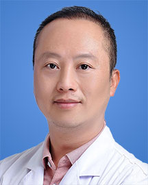

<!-- AUTO-GENERATED-BY: work/generate_obsidian_profiles.py -->

<!-- TEMPLATE: D:\workspace\信息收集整理\医生画像仓库\模板\医生画像模板.md -->

# 肖乐

## 基础信息

| 字段 | 内容 |
|---|---|
| 姓名 | 肖乐 |
| 医院 | 广东省人民医院 |
| 科室 | 血管外科 |
| 职称/身份 | 主任医师 |
| 来源链接 | [官网原文](https://www.gdghospital.org.cn/Expertlistt/info_itemid_57346_subjectid_9.html) |
| 采集日期 | 2026-08-14 |

## 简介/擅长

擅长血管外科疾病的诊治和预防，熟练掌握微创介入和开放手术技术，包括腹主动 脉瘤、下肢静脉曲张、下肢深静脉血栓、主动脉夹层、下肢动脉硬化狭窄、四肢和 内脏血管血栓、颈动脉狭窄、血液透析通路的构建与维护等

## 教育与进修经历

- 简介 主任医师，博士，硕士生导师 ■ 中国医师协会血管外科医师分会腹主动脉学组委员 ■ 中国医师协会血管外科医师分会静脉曲张与静脉功能不全学组委员 ■ 国际血管联盟中国静脉曲张专家委员会委员 ■ 中国医师协会介入医师分会超声介入专委会血管通路学组委员 ■ 中国医师协会介入医师分会超声介入专委会外周介入学组委员 ■ 中国微循环学会下肢静脉腔内专委会常委 ■ 海峡两岸医药交流协会血管通路学组委员 ■ 中国微循环学会血管外科分会中青年委员会委员 ■ “兴滇英才” ■ 广东省医师协会血管外科医师分会秘书 毕业于东南大学…
- 主持国家自然科学基金2项、人社部回国留学人员基金1项、省基金4项、中华医学 会医学教育分会课题1项；

## 科研项目与成果

- 主持国家自然科学基金2项、人社部回国留学人员基金1项、省基金4项、中华医学 会医学教育分会课题1项；
- 积极开展科学研究，在腹主动脉瘤、主动脉夹层、下肢静脉曲张的临床研究，糖尿 病下肢动脉硬化、以及血管重建术后再狭窄的基础研究方面取得一定成果，获得省 科技进步二等奖2项。

## 论文与学术产出

- 获省科技进步二等奖2项，发表论文60余篇，多次参加 国际、国内学术会议交流发言，包括美国血管与腔内血管大会（VEITH），世界静 脉大会，亚洲血管外科年会，中华医学会外科学分会血管外科学组年会，中国医师 协会血管外科医师分会年会，中国血管论坛，中国南方血管大会、中国静脉论坛 等。
- 乐于进行科普宣传，《认识腹主动脉瘤》入选人民卫生出版社“血管新声代”健康科 普专辑，多次参加各种科普活动，发表《谁是下肢静脉曲张的罪魁祸首》、《二氧 化碳造影-让不可能成为可能》、《我的胃肠镜初体验》、《泡脚虽好，但你真的 泡对了吗》等科普文章。

## 可包装亮点

- 简介 主任医师，博士，硕士生导师 ■ 中国医师协会血管外科医师分会腹主动脉学组委员 ■ 中国医师协会血管外科医师分会静脉曲张与静脉功能不全学组委员 ■ 国际血管联盟中国静脉曲张专家委员会委员 ■ 中国医师协会介入医师分会超声介入专委会血管通路学组委员 ■ 中国医师协会介入医师分会超声介入专委会外周介入学组委员 ■ 中国微循环学会下肢静脉腔内专委会常委 ■…
- 主持国家自然科学基金2项、人社部回国留学人员基金1项、省基金4项、中华医学 会医学教育分会课题1项；
- 获省科技进步二等奖2项，发表论文60余...

## 重点疾病/人群标签

- 慢性病：
- 肿瘤：瘤、术后
- 生殖疾病：
- 免疫/风湿：
- 术后恢复/康复：瘤、术后
- 疑难重症：

## 证据摘录

> 只摘录官网公开信息中的短句或关键字段，不复制大段原文。

- 官网身份字段：主任医师
- 官网简介/擅长：擅长血管外科疾病的诊治和预防，熟练掌握微创介入和开放手术技术，包括腹主动 脉瘤、下肢静脉曲张、下肢深静脉血栓、主动脉夹层、下肢动脉硬化狭窄、四肢和 内脏血管血栓、颈动脉狭窄、血液透析通路的构建与维护等
- 官网亮眼经历线索：简介 主任医师，博士，硕士生导师 ■ 中国医师协会血管外科医师分会腹主动脉学组委员 ■ 中国医师协会血管外科医师分会静脉曲张与静脉功能不全学组委员 ■ 国际血管联盟中国静脉曲张专家委员会委员 ■ 中国医师协会介入医师分会超声介入专委会血管通路学组委员 ■ 中国医师协会介入医师分会超声介入专委会外周介入学组委员 ■ 中国微循环学会下肢静脉腔内专委会常委 ■ 海峡两岸医药交流协会血管通路学组委员 ■ 中国微循环学会血管外科分会中青年委员会…
- 来源链接：https://www.gdghospital.org.cn/Expertlistt/info_itemid_57346_subjectid_9.html

## BD 画像摘要

肖乐医生可作为肿瘤、术后恢复/康复方向的基础画像候选。后续 BD 使用应继续以官网来源和人工复核为准，不添加疗效承诺或无来源包装。

## 合规边界

- 仅使用医院官网、官方公众号、官方小程序等公开渠道。
- 不采集私人电话、私人微信、家庭住址、患者隐私或非公开排班信息。
- 不写“保证治愈”“疗效第一”“包治疑难杂症”等无法由官网证明的表述。
