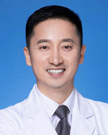

<!-- AUTO-GENERATED-BY: work/generate_obsidian_profiles.py -->

<!-- TEMPLATE: D:\workspace\信息收集整理\医生画像仓库\模板\医生画像模板.md -->

# 肖进

## 基础信息

| 字段 | 内容 |
|---|---|
| 姓名 | 肖进 |
| 医院 | 广东省人民医院 |
| 科室 | 关节骨病与创伤科 |
| 职称/身份 | 主任医师 |
| 来源链接 | [官网原文](https://www.gdghospital.org.cn/Expertlistt/info_itemid_24320_subjectid_49.html) |
| 采集日期 | 2026-08-14 |

## 简介/擅长

足踝外科和创伤骨科伤病的诊治，尤其在足踝部畸形矫正和各种创伤后遗症治疗等领域有丰富的临床经验和大量的病例积累

## 科研项目与成果

- 主要社会兼职 广东省医学会创伤骨科学分会足踝创伤学组 副组长 广东省老年保健协会创伤骨科专委会 副主任委员 广东省医师协会创伤骨科医师分会 常务委员 广东省医学会修复重建外科学分会 常务委员 广东省临床医学会足踝外科学组 常务委员 广东省中西医结合学会足踝专业委员会 常务委员 中国康复医学会广东省修复重建外科学分会 常务委员 《中华创伤骨科杂志》特邀编委 研究方向 从事骨科临床、科研及教学工作近30年，擅长足踝外科和创伤骨科伤病的诊治，尤其在足踝部畸形矫正和各种创伤后遗症治疗等领域有丰富的临床经验和大量的病例积累。
- 主要科研方向为骨及软组织生物力学，骨关节三维重建等。
- 主持及参与国家和省市级科研课题多项，以第一完成人获军队科技进步三等奖和军队医疗成果三等奖2项，参编专著5部。

## 论文与学术产出

- 学术专业领域成就 已发表学术论文40余篇，其中SCI收录论文10余篇。
- 主持及参与国家和省市级科研课题多项，以第一完成人获军队科技进步三等奖和军队医疗成果三等奖2项，参编专著5部。

## 可包装亮点

- 主要社会兼职 广东省医学会创伤骨科学分会足踝创伤学组 副组长 广东省老年保健协会创伤骨科专委会 副主任委员 广东省医师协会创伤骨科医师分会 常务委员 广东省医学会修复重建外科学分会 常务委员 广东省临床医学会足踝外科学组 常务委员 广东省中西医结合学会足踝专业委员会 常务委员 中国康复医学会广东省修复重建外科学分会 常务委员 《中华创伤骨科杂志》特邀编委…
- 学术专业领域成就 已发表学术论文40余篇，其中SCI收录论文10余篇。
- 主持及参与国家和省市级科研课题多项，以第一完成人获军队科技进步三等奖和军队医疗成果三等奖2项，参编专著5部。

## 重点疾病/人群标签

- 慢性病：
- 肿瘤：
- 生殖疾病：
- 免疫/风湿：
- 术后恢复/康复：康复
- 疑难重症：

## 证据摘录

> 只摘录官网公开信息中的短句或关键字段，不复制大段原文。

- 官网身份字段：主任医师
- 官网简介/擅长：足踝外科和创伤骨科伤病的诊治，尤其在足踝部畸形矫正和各种创伤后遗症治疗等领域有丰富的临床经验和大量的病例积累
- 官网亮眼经历线索：主要社会兼职 广东省医学会创伤骨科学分会足踝创伤学组 副组长 广东省老年保健协会创伤骨科专委会 副主任委员 广东省医师协会创伤骨科医师分会 常务委员 广东省医学会修复重建外科学分会 常务委员 广东省临床医学会足踝外科学组 常务委员 广东省中西医结合学会足踝专业委员会 常务委员 中国康复医学会广东省修复重建外科学分会 常务委员 《中华创伤骨科杂志》特邀编委 研究方向 从事骨科临床、科研及教学工作近30年，擅长足踝外科和创伤骨科伤病的诊治…
- 来源链接：https://www.gdghospital.org.cn/Expertlistt/info_itemid_24320_subjectid_49.html

## BD 画像摘要

肖进医生可作为术后恢复/康复方向的基础画像候选。后续 BD 使用应继续以官网来源和人工复核为准，不添加疗效承诺或无来源包装。

## 合规边界

- 仅使用医院官网、官方公众号、官方小程序等公开渠道。
- 不采集私人电话、私人微信、家庭住址、患者隐私或非公开排班信息。
- 不写“保证治愈”“疗效第一”“包治疑难杂症”等无法由官网证明的表述。
