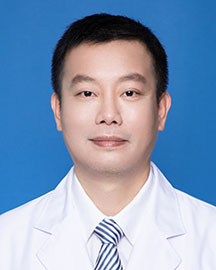

<!-- AUTO-GENERATED-BY: work/generate_obsidian_profiles.py -->

<!-- TEMPLATE: D:\workspace\信息收集整理\医生画像仓库\模板\医生画像模板.md -->

# 肖长裕

## 基础信息

| 字段 | 内容 |
|---|---|
| 姓名 | 肖长裕 |
| 医院 | 广东省人民医院 |
| 科室 | 中医内科 |
| 职称/身份 | 主治医师 |
| 来源链接 | [官网原文](https://www.gdghospital.org.cn/Expertlistt/info_itemid_25420_subjectid_98.html) |
| 采集日期 | 2026-08-14 |

## 简介/擅长

心脑血管疾病（冠心病、心绞痛、心律失常、眩晕、中风），呼吸系统疾病（上呼吸道感染、支气管炎、肺炎、哮喘及肺癌等），消化系统疾病（急慢性胃肠炎、胆囊炎、胆囊结石、肝癌、结肠癌等）毕业于广州中医药大学，长期工作于临床一线，为广东省名中医继承人，曾先后师从广东省名中医黄松柏主任及叶安娜主任，中西医高血压病委员会委员，脑病康复委员会委员，广东省中医药学会络病专业委员会委员，国家2级公共营养师

## 教育与进修经历

- 中共党员 擅长心脑血管疾病（冠心病、心绞痛、心律失常、眩晕、中风），呼吸系统疾病（上呼吸道感染、支气管炎、肺炎、哮喘及肺癌等），消化系统疾病（急慢性胃肠炎、胆囊炎、胆囊结石、肝癌、结肠癌等）毕业于广州中医药大学，长期工作于临床一线，为广东省名中医继承人，曾先后师从广东省名中医黄松柏主任及叶安娜主任，中西医高血压病委员会委员，脑病康复委员会委员，广东省中医药学会络病专业委员会委员，国家2级公共营养师。

## 可包装亮点

- 中共党员 擅长心脑血管疾病（冠心病、心绞痛、心律失常、眩晕、中风），呼吸系统疾病（上呼吸道感染、支气管炎、肺炎、哮喘及肺癌等），消化系统疾病（急慢性胃肠炎、胆囊炎、胆囊结石、肝癌、结肠癌等）毕业于广州中医药大学，长期工作于临床一线，为广东省名中医继承人，曾先后师从广东省名中医黄松柏主任及叶安娜主任，中西医高血压病委员会委员，脑病康复委员会委员，广东省中医药…

## 重点疾病/人群标签

- 慢性病：高血压、冠心病、慢性、肺癌、肝癌、肠癌、感染、康复、营养
- 肿瘤：高血压、冠心病、慢性、肺癌、肝癌、肠癌、感染、康复、营养
- 生殖疾病：
- 免疫/风湿：高血压、冠心病、慢性、肺癌、肝癌、肠癌、感染、康复、营养
- 术后恢复/康复：高血压、冠心病、慢性、肺癌、肝癌、肠癌、感染、康复、营养
- 疑难重症：

## 证据摘录

> 只摘录官网公开信息中的短句或关键字段，不复制大段原文。

- 官网身份字段：主治医师
- 官网简介/擅长：心脑血管疾病（冠心病、心绞痛、心律失常、眩晕、中风），呼吸系统疾病（上呼吸道感染、支气管炎、肺炎、哮喘及肺癌等），消化系统疾病（急慢性胃肠炎、胆囊炎、胆囊结石、肝癌、结肠癌等）毕业于广州中医药大学，长期工作于临床一线，为广东省名中医继承人，曾先后师从广东省名中医黄松柏主任及叶安娜主任，中西医高血压病委员会委员，脑病康复委员会委员，广东省中医药学会络病专业委员会委员，国家2级公共营养师
- 官网亮眼经历线索：中共党员 擅长心脑血管疾病（冠心病、心绞痛、心律失常、眩晕、中风），呼吸系统疾病（上呼吸道感染、支气管炎、肺炎、哮喘及肺癌等），消化系统疾病（急慢性胃肠炎、胆囊炎、胆囊结石、肝癌、结肠癌等）毕业于广州中医药大学，长期工作于临床一线，为广东省名中医继承人，曾先后师从广东省名中医黄松柏主任及叶安娜主任，中西医高血压病委员会委员，脑病康复委员会委员，广东省中医药学会络病专业委员会委员，国家2级公共营养师。
- 来源链接：https://www.gdghospital.org.cn/Expertlistt/info_itemid_25420_subjectid_98.html

## BD 画像摘要

肖长裕医生可作为慢性病、肿瘤、免疫/风湿/感染、术后恢复/康复方向的基础画像候选。后续 BD 使用应继续以官网来源和人工复核为准，不添加疗效承诺或无来源包装。

## 合规边界

- 仅使用医院官网、官方公众号、官方小程序等公开渠道。
- 不采集私人电话、私人微信、家庭住址、患者隐私或非公开排班信息。
- 不写“保证治愈”“疗效第一”“包治疑难杂症”等无法由官网证明的表述。
