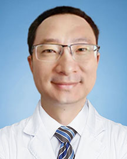

<!-- AUTO-GENERATED-BY: work/generate_obsidian_profiles.py -->

<!-- TEMPLATE: D:\workspace\信息收集整理\医生画像仓库\模板\医生画像模板.md -->

# 胡一骏

## 基础信息

| 字段 | 内容 |
|---|---|
| 姓名 | 胡一骏 |
| 医院 | 广东省人民医院 |
| 科室 | 眼科 |
| 职称/身份 | 副主任医师 |
| 来源链接 | [官网原文](https://www.gdghospital.org.cn/Expertlistt/info_itemid_43922_subjectid_46.html) |
| 采集日期 | 2026-08-14 |

## 简介/擅长

近视屈光手术的术前评估和手术方案设计，熟练完成各种常见屈光手术（SMILE全飞秒、常规和个性化FS-LASIK、表层准分子激光、ICL植入术）

## 教育与进修经历

- 博士毕业于中山大学中山眼科中心，于哈佛大学医学院完成博士后研究。

## 科研项目与成果

- 擅长屈光和视网膜方向临床科研，主持省级科研项目2项，市级科研项目1项，横向课题3项；

## 论文与学术产出

- 已发表SCI文章57篇（第一/共同第一/通讯作者45篇）。

## 可包装亮点

- 硕士生导师、医学博士 特长 擅长近视屈光手术的术前评估和手术方案设计，熟练完成各种常见屈光手术（SMILE全飞秒、常规和个性化FS-LASIK、表层准分子激光、ICL植入术）。
- 简介 医学博士，副主任医师，硕士研究生导师，中共党员。
- 已发表SCI文章57篇（第一/共同第一/通讯作者45篇）。

## 重点疾病/人群标签

- 慢性病：
- 肿瘤：
- 生殖疾病：
- 免疫/风湿：
- 术后恢复/康复：术后
- 疑难重症：

## 证据摘录

> 只摘录官网公开信息中的短句或关键字段，不复制大段原文。

- 官网身份字段：副主任医师
- 官网简介/擅长：近视屈光手术的术前评估和手术方案设计，熟练完成各种常见屈光手术（SMILE全飞秒、常规和个性化FS-LASIK、表层准分子激光、ICL植入术）
- 官网亮眼经历线索：硕士生导师、医学博士 特长 擅长近视屈光手术的术前评估和手术方案设计，熟练完成各种常见屈光手术（SMILE全飞秒、常规和个性化FS-LASIK、表层准分子激光、ICL植入术）。 简介 医学博士，副主任医师，硕士研究生导师，中共党员。 已发表SCI文章57篇（第一/共同第一/通讯作者45篇）。
- 来源链接：https://www.gdghospital.org.cn/Expertlistt/info_itemid_43922_subjectid_46.html

## BD 画像摘要

胡一骏医生可作为术后恢复/康复方向的基础画像候选。后续 BD 使用应继续以官网来源和人工复核为准，不添加疗效承诺或无来源包装。

## 合规边界

- 仅使用医院官网、官方公众号、官方小程序等公开渠道。
- 不采集私人电话、私人微信、家庭住址、患者隐私或非公开排班信息。
- 不写“保证治愈”“疗效第一”“包治疑难杂症”等无法由官网证明的表述。
