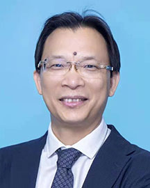

<!-- AUTO-GENERATED-BY: work/generate_obsidian_profiles.py -->

<!-- TEMPLATE: D:\workspace\信息收集整理\医生画像仓库\模板\医生画像模板.md -->

# 胡世雄

## 基础信息

| 字段 | 内容 |
|---|---|
| 姓名 | 胡世雄 |
| 医院 | 广东省人民医院 |
| 科室 | 甲状腺疝外科 |
| 职称/身份 | 主任医师 |
| 来源链接 | [官网原文](https://www.gdghospital.org.cn/Expertlistt/info_itemid_24137_subjectid_107.html) |
| 采集日期 | 2026-08-14 |

## 简介/擅长

甲状腺和腹壁疝手术的微创治疗，尤其擅长各类腔镜疝和甲状腺手术

## 科研项目与成果

- 主持课题数项，国内外核心刊物发表论文数十篇，参编专著3本。

## 论文与学术产出

- 主持课题数项，国内外核心刊物发表论文数十篇，参编专著3本。

## 可包装亮点

- 对各类腹壁复杂疝（造口旁疝、食管裂孔疝、切口疝）的综合治疗有较高造诣，作为主要成员参与国内多部指南和专家共识的制定。
- 教育经历和专业特长 中共党员，医学博士，博士导师，日间手术中心主任，综合外科行政主任，荣获2023年广东省人民医院“医德医风十佳”奖，2024年“广州好医生”称号。
- 主要社会任职 中国医师协会外科医师分会疝与腹壁外科分会委员 中国医师协会外科医师分会胃食管反流疾病诊疗专业委员会委员 广东省医师协会疝与腹壁外科分会主任委员 广东省基层药基协会疝和腹壁外科分会主任委员 国际内镜疝学会中国分会委员 全国卫生企业协会疝分会广东学组组长 粤港澳大湾区疝外科医师联盟副主任委员 《中华疝与腹壁外科杂志》编辑委员会委员 教育经历 曾到…
- 曾获腹股沟疝手术视频大赛全国冠军等奖项。

## 重点疾病/人群标签

- 慢性病：
- 肿瘤：癌、复杂
- 生殖疾病：
- 免疫/风湿：
- 术后恢复/康复：
- 疑难重症：癌、复杂

## 证据摘录

> 只摘录官网公开信息中的短句或关键字段，不复制大段原文。

- 官网身份字段：主任医师
- 官网简介/擅长：甲状腺和腹壁疝手术的微创治疗，尤其擅长各类腔镜疝和甲状腺手术
- 官网亮眼经历线索：对各类腹壁复杂疝（造口旁疝、食管裂孔疝、切口疝）的综合治疗有较高造诣，作为主要成员参与国内多部指南和专家共识的制定。 教育经历和专业特长 中共党员，医学博士，博士导师，日间手术中心主任，综合外科行政主任，荣获2023年广东省人民医院“医德医风十佳”奖，2024年“广州好医生”称号。 主要社会任职 中国医师协会外科医师分会疝与腹壁外科分会委员 中国医师协会外科医师分会胃食管反流疾病诊疗专业委员会委员 广东省医师协会疝与腹壁外科分会主任委…
- 来源链接：https://www.gdghospital.org.cn/Expertlistt/info_itemid_24137_subjectid_107.html

## BD 画像摘要

胡世雄医生可作为肿瘤、疑难重症方向的基础画像候选。后续 BD 使用应继续以官网来源和人工复核为准，不添加疗效承诺或无来源包装。

## 合规边界

- 仅使用医院官网、官方公众号、官方小程序等公开渠道。
- 不采集私人电话、私人微信、家庭住址、患者隐私或非公开排班信息。
- 不写“保证治愈”“疗效第一”“包治疑难杂症”等无法由官网证明的表述。
