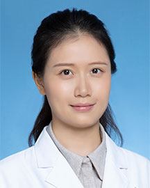

<!-- AUTO-GENERATED-BY: work/generate_obsidian_profiles.py -->

<!-- TEMPLATE: D:\workspace\信息收集整理\医生画像仓库\模板\医生画像模板.md -->

# 胡雪姣

## 基础信息

| 字段 | 内容 |
|---|---|
| 姓名 | 胡雪姣 |
| 医院 | 广东省人民医院 |
| 科室 | 检验科 |
| 职称/身份 | 副研究员、主管技师 |
| 来源链接 | [官网原文](https://www.gdghospital.org.cn/Expertlistt/info_itemid_32976_subjectid_60.html) |
| 采集日期 | 2026-08-14 |

## 简介/擅长

## 教育与进修经历

- 2019年毕业于四川大学华西临床医学院临床检验诊断学专业；

## 科研项目与成果

- 医学博士，学科交叉组组长，病原测序项目负责人。
- 发表SCI 18篇，主持国自然青年等课题6项，获专利授权7项，转化3项。
- 入选2021年广州市青年托举人才工程项目/2022年广东省青年科技人才培育计划。

## 论文与学术产出

- 发表SCI 18篇，主持国自然青年等课题6项，获专利授权7项，转化3项。

## 可包装亮点

- 2017-2019年于多伦多大学分子遗传学与计算生物学系访问学习。
- 发表SCI 18篇，主持国自然青年等课题6项，获专利授权7项，转化3项。
- 入选2021年广州市青年托举人才工程项目/2022年广东省青年科技人才培育计划。
- 中华医学会结核病学分会第十八届委员会科技创新转化专委会委员，中国研究型医院学会结核病学专委会青年委员。

## 重点疾病/人群标签

- 慢性病：
- 肿瘤：
- 生殖疾病：
- 免疫/风湿：感染
- 术后恢复/康复：
- 疑难重症：

## 证据摘录

> 只摘录官网公开信息中的短句或关键字段，不复制大段原文。

- 官网身份字段：副研究员、主管技师
- 官网亮眼经历线索：2017-2019年于多伦多大学分子遗传学与计算生物学系访问学习。 发表SCI 18篇，主持国自然青年等课题6项，获专利授权7项，转化3项。 入选2021年广州市青年托举人才工程项目/2022年广东省青年科技人才培育计划。 中华医学会结核病学分会第十八届委员会科技创新转化专委会委员，中国研究型医院学会结核病学专委会青年委员。
- 来源链接：https://www.gdghospital.org.cn/Expertlistt/info_itemid_32976_subjectid_60.html

## BD 画像摘要

胡雪姣医生可作为免疫/风湿/感染方向的基础画像候选。后续 BD 使用应继续以官网来源和人工复核为准，不添加疗效承诺或无来源包装。

## 合规边界

- 仅使用医院官网、官方公众号、官方小程序等公开渠道。
- 不采集私人电话、私人微信、家庭住址、患者隐私或非公开排班信息。
- 不写“保证治愈”“疗效第一”“包治疑难杂症”等无法由官网证明的表述。
