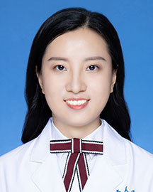

<!-- AUTO-GENERATED-BY: work/generate_obsidian_profiles.py -->

<!-- TEMPLATE: D:\workspace\信息收集整理\医生画像仓库\模板\医生画像模板.md -->

# 臧思雯

## 基础信息

| 字段 | 内容 |
|---|---|
| 姓名 | 臧思雯 |
| 医院 | 广东省人民医院 |
| 科室 | 眼科 |
| 职称/身份 | 医师 |
| 来源链接 | [官网原文](https://www.gdghospital.org.cn/Expertlistt/info_itemid_24995_subjectid_46.html) |
| 采集日期 | 2026-08-14 |

## 简介/擅长

角结膜炎、干眼症、翼状胬肉、睑内翻倒睫、结膜囊畸形、角膜烧伤等眼表疾病的诊治，擅长斜视、上睑下垂等眼肌疾病、白内障、黄斑疾病及视网膜脱离和神经眼科疾病的诊治

## 科研项目与成果

- 主持及参与完成多项国家省市级科研项目，曾在《JAMA Ophthalmology》、《Eye》等杂志发表多篇论文，并在国内外大型学术会议发表学术成果。

## 论文与学术产出

- 主持及参与完成多项国家省市级科研项目，曾在《JAMA Ophthalmology》、《Eye》等杂志发表多篇论文，并在国内外大型学术会议发表学术成果。

## 可包装亮点

- 中共党员 北京大学八年制，眼科学博士，现任亚洲干眼协会委员，广东省医师协会眼科医师分会，斜视弱视与视觉康复专业组委员。
- 曾至香港大学玛丽医院及美国芝加哥大学访问交流。
- 主持及参与完成多项国家省市级科研项目，曾在《JAMA Ophthalmology》、《Eye》等杂志发表多篇论文，并在国内外大型学术会议发表学术成果。

## 重点疾病/人群标签

- 慢性病：
- 肿瘤：
- 生殖疾病：
- 免疫/风湿：感染、康复、烧伤
- 术后恢复/康复：感染、康复、烧伤
- 疑难重症：

## 证据摘录

> 只摘录官网公开信息中的短句或关键字段，不复制大段原文。

- 官网身份字段：医师
- 官网简介/擅长：角结膜炎、干眼症、翼状胬肉、睑内翻倒睫、结膜囊畸形、角膜烧伤等眼表疾病的诊治，擅长斜视、上睑下垂等眼肌疾病、白内障、黄斑疾病及视网膜脱离和神经眼科疾病的诊治
- 官网亮眼经历线索：中共党员 北京大学八年制，眼科学博士，现任亚洲干眼协会委员，广东省医师协会眼科医师分会，斜视弱视与视觉康复专业组委员。 曾至香港大学玛丽医院及美国芝加哥大学访问交流。 主持及参与完成多项国家省市级科研项目，曾在《JAMA Ophthalmology》、《Eye》等杂志发表多篇论文，并在国内外大型学术会议发表学术成果。
- 来源链接：https://www.gdghospital.org.cn/Expertlistt/info_itemid_24995_subjectid_46.html

## BD 画像摘要

臧思雯医生可作为免疫/风湿/感染、术后恢复/康复方向的基础画像候选。后续 BD 使用应继续以官网来源和人工复核为准，不添加疗效承诺或无来源包装。

## 合规边界

- 仅使用医院官网、官方公众号、官方小程序等公开渠道。
- 不采集私人电话、私人微信、家庭住址、患者隐私或非公开排班信息。
- 不写“保证治愈”“疗效第一”“包治疑难杂症”等无法由官网证明的表述。
