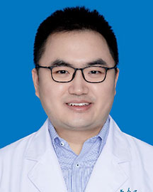

<!-- AUTO-GENERATED-BY: work/generate_obsidian_profiles.py -->

<!-- TEMPLATE: D:\workspace\信息收集整理\医生画像仓库\模板\医生画像模板.md -->

# 臧鑫

## 基础信息

| 字段 | 内容 |
|---|---|
| 姓名 | 臧鑫 |
| 医院 | 广东省人民医院 |
| 科室 | 心外科 |
| 职称/身份 | 副主任医师 |
| 来源链接 | [官网原文](https://www.gdghospital.org.cn/Expertlistt/info_itemid_24379_subjectid_80.html) |
| 采集日期 | 2026-08-14 |

## 简介/擅长

擅长疾病：风湿性心脏瓣膜病，二尖瓣脱垂，主动脉瓣狭窄，主动脉瓣关闭不全，感染性心内膜炎，房间隔缺损，心房粘液瘤，冠心病等心外科常见疾病擅长手术： 1、胸腔镜下微创二尖瓣手术（修复/置换） 2、胸腔镜下微创三尖瓣手术（修复/置换） 3、胸腔镜下微创房间隔缺损修补术 4、胸腔镜下微创心房粘液瘤切除术 5、胸腔镜下微创主动脉瓣置换手术 6、经皮/经心尖介入主动脉瓣置换术（TAVR手术） 7、冠状动脉搭桥手术 简介 医学博士，副主任医师，心外科手术组长

## 教育与进修经历

- 毕业于北京大学医学部临床医学八年制专业，师从于我国胸腔镜外科奠基人，中国工程院王俊院士。
- 毕业后在广东省人民医院从事心外科工作10余年，2017年赴瑞典林雪平大学附属医院担任访问学者。

## 科研项目与成果

- 致力于心脏瓣膜疾病和冠状动脉疾病的临床和基础研究，发表学术论文10余篇，主持省部级科研课题1项。
- 荣誉奖励 申报项目《全胸腔镜下微创同期双瓣膜手术》获2022年度广东省人民医院医疗新技术二等奖。

## 论文与学术产出

- 致力于心脏瓣膜疾病和冠状动脉疾病的临床和基础研究，发表学术论文10余篇，主持省部级科研课题1项。

## 可包装亮点

- 专长 擅长疾病：风湿性心脏瓣膜病，二尖瓣脱垂，主动脉瓣狭窄，主动脉瓣关闭不全，感染性心内膜炎，房间隔缺损，心房粘液瘤，冠心病等心外科常见疾病擅长手术： 1、胸腔镜下微创二尖瓣手术（修复/置换） 2、胸腔镜下微创三尖瓣手术（修复/置换） 3、胸腔镜下微创房间隔缺损修补术 4、胸腔镜下微创心房粘液瘤切除术 5、胸腔镜下微创主动脉瓣置换手术 6、经皮/经心尖介入…
- 毕业后在广东省人民医院从事心外科工作10余年，2017年赴瑞典林雪平大学附属医院担任访问学者。
- 致力于心脏瓣膜疾病和冠状动脉疾病的临床和基础研究，发表学术论文10余篇，主持省部级科研课题1项。
- 荣誉奖励 申报项目《全胸腔镜下微创同期双瓣膜手术》获2022年度广东省人民医院医疗新技术二等奖。

## 重点疾病/人群标签

- 慢性病：冠心病、瘤、风湿、感染
- 肿瘤：冠心病、瘤、风湿、感染
- 生殖疾病：
- 免疫/风湿：冠心病、瘤、风湿、感染
- 术后恢复/康复：
- 疑难重症：

## 证据摘录

> 只摘录官网公开信息中的短句或关键字段，不复制大段原文。

- 官网身份字段：副主任医师
- 官网简介/擅长：擅长疾病：风湿性心脏瓣膜病，二尖瓣脱垂，主动脉瓣狭窄，主动脉瓣关闭不全，感染性心内膜炎，房间隔缺损，心房粘液瘤，冠心病等心外科常见疾病擅长手术： 1、胸腔镜下微创二尖瓣手术（修复/置换） 2、胸腔镜下微创三尖瓣手术（修复/置换） 3、胸腔镜下微创房间隔缺损修补术 4、胸腔镜下微创心房粘液瘤切除术 5、胸腔镜下微创主动脉瓣置换手术 6、经皮/经心尖介入主动脉瓣置换术（TAVR手术） 7、冠状动脉搭桥手术 简介 医学博士，副主任医师，心外…
- 官网亮眼经历线索：专长 擅长疾病：风湿性心脏瓣膜病，二尖瓣脱垂，主动脉瓣狭窄，主动脉瓣关闭不全，感染性心内膜炎，房间隔缺损，心房粘液瘤，冠心病等心外科常见疾病擅长手术： 1、胸腔镜下微创二尖瓣手术（修复/置换） 2、胸腔镜下微创三尖瓣手术（修复/置换） 3、胸腔镜下微创房间隔缺损修补术 4、胸腔镜下微创心房粘液瘤切除术 5、胸腔镜下微创主动脉瓣置换手术 6、经皮/经心尖介入主动脉瓣置换术（TAVR手术） 7、冠状动脉搭桥手术 简介 医学博士，副主任医师…
- 来源链接：https://www.gdghospital.org.cn/Expertlistt/info_itemid_24379_subjectid_80.html

## BD 画像摘要

臧鑫医生可作为慢性病、肿瘤、免疫/风湿/感染方向的基础画像候选。后续 BD 使用应继续以官网来源和人工复核为准，不添加疗效承诺或无来源包装。

## 合规边界

- 仅使用医院官网、官方公众号、官方小程序等公开渠道。
- 不采集私人电话、私人微信、家庭住址、患者隐私或非公开排班信息。
- 不写“保证治愈”“疗效第一”“包治疑难杂症”等无法由官网证明的表述。
