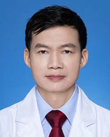

<!-- AUTO-GENERATED-BY: work/generate_obsidian_profiles.py -->

<!-- TEMPLATE: D:\workspace\信息收集整理\医生画像仓库\模板\医生画像模板.md -->

# 舒海华

## 基础信息

| 字段 | 内容 |
|---|---|
| 姓名 | 舒海华 |
| 医院 | 广东省人民医院 |
| 科室 | 麻醉科 |
| 职称/身份 | 主任医师 科主任 |
| 来源链接 | [官网原文](https://www.gdghospital.org.cn/Expertlistt/info_itemid_65681_subjectid_13.html) |
| 采集日期 | 2026-08-14 |

## 简介/擅长

擅长脊柱畸形矫正手术、器官移植手术和心脏大血管手术麻醉，以及危重患者、老年人 和小儿患者麻醉

## 教育与进修经历

- 简介 主任医师，科室主任，医学博士，博士生导师，博士后合作导师。

## 可包装亮点

- 专长 擅长脊柱畸形矫正手术、器官移植手术和心脏大血管手术麻醉，以及危重患者、老年人 和小儿患者麻醉。
- 简介 主任医师，科室主任，医学博士，博士生导师，博士后合作导师。
- 担任中国心胸血管麻醉学会大数据分会主委、 省精准医学应用学会精准麻醉分会主委，《中华麻醉学杂志》通讯编委、《中国临床研 究》编委。
- 荣誉奖励 “珠江人才计划”领军人才，羊城好医生（家庭医生在线）

## 重点疾病/人群标签

- 慢性病：
- 肿瘤：
- 生殖疾病：
- 免疫/风湿：
- 术后恢复/康复：疼痛、危重
- 疑难重症：疼痛、危重

## 证据摘录

> 只摘录官网公开信息中的短句或关键字段，不复制大段原文。

- 官网身份字段：主任医师 科主任
- 官网简介/擅长：擅长脊柱畸形矫正手术、器官移植手术和心脏大血管手术麻醉，以及危重患者、老年人 和小儿患者麻醉
- 官网亮眼经历线索：专长 擅长脊柱畸形矫正手术、器官移植手术和心脏大血管手术麻醉，以及危重患者、老年人 和小儿患者麻醉。 简介 主任医师，科室主任，医学博士，博士生导师，博士后合作导师。 担任中国心胸血管麻醉学会大数据分会主委、 省精准医学应用学会精准麻醉分会主委，《中华麻醉学杂志》通讯编委、《中国临床研 究》编委。 荣誉奖励 “珠江人才计划”领军人才，羊城好医生（家庭医生在线）
- 来源链接：https://www.gdghospital.org.cn/Expertlistt/info_itemid_65681_subjectid_13.html

## BD 画像摘要

舒海华医生可作为术后恢复/康复、疑难重症方向的基础画像候选。后续 BD 使用应继续以官网来源和人工复核为准，不添加疗效承诺或无来源包装。

## 合规边界

- 仅使用医院官网、官方公众号、官方小程序等公开渠道。
- 不采集私人电话、私人微信、家庭住址、患者隐私或非公开排班信息。
- 不写“保证治愈”“疗效第一”“包治疑难杂症”等无法由官网证明的表述。
