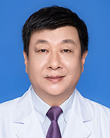

<!-- AUTO-GENERATED-BY: work/generate_obsidian_profiles.py -->

<!-- TEMPLATE: D:\workspace\信息收集整理\医生画像仓库\模板\医生画像模板.md -->

# 范瑞新

## 基础信息

| 字段 | 内容 |
|---|---|
| 姓名 | 范瑞新 |
| 医院 | 广东省人民医院 |
| 科室 | 心外科 |
| 职称/身份 | 主任医师 |
| 来源链接 | [官网原文](https://www.gdghospital.org.cn/Expertlistt/info_itemid_25488_subjectid_80.html) |
| 采集日期 | 2026-08-14 |

## 简介/擅长

## 科研项目与成果

- 参与科技部国家科技计划、国家卫生健康委员会重大慢性非传染性疾病防控研究、卫计委益性行业科研专项重大项目、“九五”、“十五”攻关课题的研究工作，国家“十二五”科技支撑项目，主持广东省自然科学基金项目、广东省科委重大疾病科研基金项目、广东省科技计划项目、广东省卫生厅基金项目、广州市科技计划重大项目等多项研究工作。

## 可包装亮点

- 医学博士、广东省心血管病研究所博士生导师，华南理工大学、南方医科大学硕士生导师。
- 中国医师协会心血管外科医师分会第四届委员会所属大血管学术委员会副主任委员，中国医师协会心血管外科分会第四届委员会所属介入专业委员会副主任委员，广东省医师协会血管病医师分会主任委员,中国医药生物技术协会心血管外科技术与工程分会常务委员，广东省医学会心胸外科常务委员，广东省医师协会心血管外科医师分会委员。
- 参与科技部国家科技计划、国家卫生健康委员会重大慢性非传染性疾病防控研究、卫计委益性行业科研专项重大项目、“九五”、“十五”攻关课题的研究工作，国家“十二五”科技支撑项目，主持广东省自然科学基金项目、广东省科委重大疾病科研基金项目、广东省科技计划项目、广东省卫生厅基金项目、广州市科技计划重大项目等多项研究工作。
- 获广东省科学技术二等奖、 “中国医师协会心血管外科医师奖”（简称“金刀奖”）、广东省科学技术三等奖、 “国之名医·卓越建树”称号、 “2...

## 重点疾病/人群标签

- 慢性病：慢性
- 肿瘤：
- 生殖疾病：
- 免疫/风湿：
- 术后恢复/康复：
- 疑难重症：

## 证据摘录

> 只摘录官网公开信息中的短句或关键字段，不复制大段原文。

- 官网身份字段：主任医师
- 官网亮眼经历线索：医学博士、广东省心血管病研究所博士生导师，华南理工大学、南方医科大学硕士生导师。 中国医师协会心血管外科医师分会第四届委员会所属大血管学术委员会副主任委员，中国医师协会心血管外科分会第四届委员会所属介入专业委员会副主任委员，广东省医师协会血管病医师分会主任委员,中国医药生物技术协会心血管外科技术与工程分会常务委员，广东省医学会心胸外科常务委员，广东省医师协会心血管外科医师分会委员。 参与科技部国家科技计划、国家卫生健康委员会重大慢性非…
- 来源链接：https://www.gdghospital.org.cn/Expertlistt/info_itemid_25488_subjectid_80.html

## BD 画像摘要

范瑞新医生可作为慢性病方向的基础画像候选。后续 BD 使用应继续以官网来源和人工复核为准，不添加疗效承诺或无来源包装。

## 合规边界

- 仅使用医院官网、官方公众号、官方小程序等公开渠道。
- 不采集私人电话、私人微信、家庭住址、患者隐私或非公开排班信息。
- 不写“保证治愈”“疗效第一”“包治疑难杂症”等无法由官网证明的表述。
