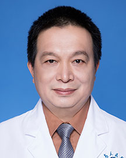

<!-- AUTO-GENERATED-BY: work/generate_obsidian_profiles.py -->

<!-- TEMPLATE: D:\workspace\信息收集整理\医生画像仓库\模板\医生画像模板.md -->

# 莫建伟

## 基础信息

| 字段 | 内容 |
|---|---|
| 姓名 | 莫建伟 |
| 医院 | 广东省人民医院 |
| 科室 | 老年神经科 |
| 职称/身份 | 主任医师 |
| 来源链接 | [官网原文](https://www.gdghospital.org.cn/Expertlistt/info_itemid_25116_subjectid_91.html) |
| 采集日期 | 2026-08-14 |

## 简介/擅长

熟练掌握各种神经系统疾病诊治，尤其擅长脑血管疾病、帕金森病、痴呆症、癫痫、各种心理障碍性疾病、各种眩晕症及痛症的诊治

## 科研项目与成果

- 荣誉奖励 ：荣获中国“八五”科学技术成果奖，中华人民共和国教育部科学技术进步二等奖，广东省科学技术进步二、三等奖，广东省医药卫生科学进步三等奖。

## 可包装亮点

- 简介 ：主任医师，硕士导师，从事神经内科专业临床及教学工作37年余，担任广东省医师协会神经内科医师分会第二、三届常务委员。
- 荣誉奖励 ：荣获中国“八五”科学技术成果奖，中华人民共和国教育部科学技术进步二等奖，广东省科学技术进步二、三等奖，广东省医药卫生科学进步三等奖。

## 重点疾病/人群标签

- 慢性病：
- 肿瘤：
- 生殖疾病：
- 免疫/风湿：
- 术后恢复/康复：
- 疑难重症：

## 证据摘录

> 只摘录官网公开信息中的短句或关键字段，不复制大段原文。

- 官网身份字段：主任医师
- 官网简介/擅长：熟练掌握各种神经系统疾病诊治，尤其擅长脑血管疾病、帕金森病、痴呆症、癫痫、各种心理障碍性疾病、各种眩晕症及痛症的诊治
- 官网亮眼经历线索：简介 ：主任医师，硕士导师，从事神经内科专业临床及教学工作37年余，担任广东省医师协会神经内科医师分会第二、三届常务委员。 荣誉奖励 ：荣获中国“八五”科学技术成果奖，中华人民共和国教育部科学技术进步二等奖，广东省科学技术进步二、三等奖，广东省医药卫生科学进步三等奖。
- 来源链接：https://www.gdghospital.org.cn/Expertlistt/info_itemid_25116_subjectid_91.html

## BD 画像摘要

莫建伟医生可作为广东省人民医院老年神经科的基础医生资料入库。当前重点方向以总底表标签为准，官网未展示的信息保持空白。

## 合规边界

- 仅使用医院官网、官方公众号、官方小程序等公开渠道。
- 不采集私人电话、私人微信、家庭住址、患者隐私或非公开排班信息。
- 不写“保证治愈”“疗效第一”“包治疑难杂症”等无法由官网证明的表述。
