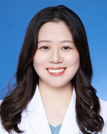

<!-- AUTO-GENERATED-BY: work/generate_obsidian_profiles.py -->

<!-- TEMPLATE: D:\workspace\信息收集整理\医生画像仓库\模板\医生画像模板.md -->

# 葛岩

## 基础信息

| 字段 | 内容 |
|---|---|
| 姓名 | 葛岩 |
| 医院 | 广东省人民医院 |
| 科室 | 病理科 |
| 职称/身份 | 主治医师 |
| 来源链接 | [官网原文](https://www.gdghospital.org.cn/Expertlistt/info_itemid_25301_subjectid_59.html) |
| 采集日期 | 2026-08-14 |

## 简介/擅长

## 教育与进修经历

- 吉林大学病理学与病理生理学博士，美国约翰霍普金斯大学博士后，于2013年来院工作。
- 学习经历及工作历程 ： 1999-2004 吉林大学临床医学专业 学士 2004-2006 吉林大学病理学与病理生理学 硕士阶段 2006-2009 吉林大学病理学与病理生理学 博士 2007-2008 美国约翰霍普金斯大学外科 交换学生 2008-2013 美国约翰霍普金斯大学眼科 博士后 科研工作 ：于Frontiers in Oncology，Diagnostic Pathology（2篇）, Quantitative Imaging in Medicine and Surgery，Pathology, I…

## 科研项目与成果

- 学习经历及工作历程 ： 1999-2004 吉林大学临床医学专业 学士 2004-2006 吉林大学病理学与病理生理学 硕士阶段 2006-2009 吉林大学病理学与病理生理学 博士 2007-2008 美国约翰霍普金斯大学外科 交换学生 2008-2013 美国约翰霍普金斯大学眼科 博士后 科研工作 ：于Frontiers in Oncology，Diagnostic Pathology（2篇）, Quantitative Imaging in Medicine and Surgery，Pathology, I…

## 可包装亮点

- 吉林大学病理学与病理生理学博士，美国约翰霍普金斯大学博士后，于2013年来院工作。
- 学习经历及工作历程 ： 1999-2004 吉林大学临床医学专业 学士 2004-2006 吉林大学病理学与病理生理学 硕士阶段 2006-2009 吉林大学病理学与病理生理学 博士 2007-2008 美国约翰霍普金斯大学外科 交换学生 2008-2013 美国约翰霍普金斯大学眼科 博士后 科研工作 ：于Frontiers in Oncology，Dia…

## 重点疾病/人群标签

- 慢性病：
- 肿瘤：
- 生殖疾病：
- 免疫/风湿：
- 术后恢复/康复：
- 疑难重症：

## 证据摘录

> 只摘录官网公开信息中的短句或关键字段，不复制大段原文。

- 官网身份字段：主治医师
- 官网亮眼经历线索：吉林大学病理学与病理生理学博士，美国约翰霍普金斯大学博士后，于2013年来院工作。 学习经历及工作历程 ： 1999-2004 吉林大学临床医学专业 学士 2004-2006 吉林大学病理学与病理生理学 硕士阶段 2006-2009 吉林大学病理学与病理生理学 博士 2007-2008 美国约翰霍普金斯大学外科 交换学生 2008-2013 美国约翰霍普金斯大学眼科 博士后 科研工作 ：于Frontiers in Oncology，D…
- 来源链接：https://www.gdghospital.org.cn/Expertlistt/info_itemid_25301_subjectid_59.html

## BD 画像摘要

葛岩医生可作为广东省人民医院病理科的基础医生资料入库。当前重点方向以总底表标签为准，官网未展示的信息保持空白。

## 合规边界

- 仅使用医院官网、官方公众号、官方小程序等公开渠道。
- 不采集私人电话、私人微信、家庭住址、患者隐私或非公开排班信息。
- 不写“保证治愈”“疗效第一”“包治疑难杂症”等无法由官网证明的表述。
