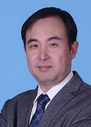

<!-- AUTO-GENERATED-BY: work/generate_obsidian_profiles.py -->

<!-- TEMPLATE: D:\workspace\信息收集整理\医生画像仓库\模板\医生画像模板.md -->

# 葛平江

## 基础信息

| 字段 | 内容 |
|---|---|
| 姓名 | 葛平江 |
| 医院 | 广东省人民医院 |
| 科室 | 咽喉头颈外科 |
| 职称/身份 | 主任医师 |
| 来源链接 | [官网原文](https://www.gdghospital.org.cn/Expertlistt/info_itemid_24944_subjectid_45.html) |
| 采集日期 | 2026-08-14 |

## 简介/擅长

## 教育与进修经历

- 学术简历 ： 1997.8-2002.7 中国协和医科大学北京协和医院 耳鼻喉科攻读硕-博士学位 2002.7-至今 广东省人民医院耳鼻咽喉-头颈外科主治、副主任医师，主任医师 南方医科大学/华南理工大学 硕士导师、博士生导师。
- 期间 2005.12—2007.5 美国田纳西州Vanderbilt 大学嗓音中心博士后研究并临床进修。

## 科研项目与成果

- 在该领域承担国家级课题2项，省市级课题10项。

## 论文与学术产出

- 发表国际学术文章20余篇，国内核心期刊40余篇。

## 可包装亮点

- 耳鼻咽喉头颈外科 主任医师，科主任；
- 南方医科大学/华南理工大学 教授/博士生导师 临床专业特长 ： 嗓音及喉科疾病、头颈肿瘤外科。
- 发表国际学术文章20余篇，国内核心期刊40余篇。
- 学术简历 ： 1997.8-2002.7 中国协和医科大学北京协和医院 耳鼻喉科攻读硕-博士学位 2002.7-至今 广东省人民医院耳鼻咽喉-头颈外科主治、副主任医师，主任医师 南方医科大学/华南理工大学 硕士导师、博士生导师。

## 重点疾病/人群标签

- 慢性病：
- 肿瘤：肿瘤、康复、功能障碍
- 生殖疾病：
- 免疫/风湿：
- 术后恢复/康复：肿瘤、康复、功能障碍
- 疑难重症：

## 证据摘录

> 只摘录官网公开信息中的短句或关键字段，不复制大段原文。

- 官网身份字段：主任医师
- 官网亮眼经历线索：耳鼻咽喉头颈外科 主任医师，科主任； 南方医科大学/华南理工大学 教授/博士生导师 临床专业特长 ： 嗓音及喉科疾病、头颈肿瘤外科。 发表国际学术文章20余篇，国内核心期刊40余篇。 学术简历 ： 1997.8-2002.7 中国协和医科大学北京协和医院 耳鼻喉科攻读硕-博士学位 2002.7-至今 广东省人民医院耳鼻咽喉-头颈外科主治、副主任医师，主任医师 南方医科大学/华南理工大学 硕士导师、博士生导师。
- 来源链接：https://www.gdghospital.org.cn/Expertlistt/info_itemid_24944_subjectid_45.html

## BD 画像摘要

葛平江医生可作为肿瘤、术后恢复/康复方向的基础画像候选。后续 BD 使用应继续以官网来源和人工复核为准，不添加疗效承诺或无来源包装。

## 合规边界

- 仅使用医院官网、官方公众号、官方小程序等公开渠道。
- 不采集私人电话、私人微信、家庭住址、患者隐私或非公开排班信息。
- 不写“保证治愈”“疗效第一”“包治疑难杂症”等无法由官网证明的表述。
