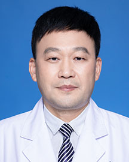

<!-- AUTO-GENERATED-BY: work/generate_obsidian_profiles.py -->

<!-- TEMPLATE: D:\workspace\信息收集整理\医生画像仓库\模板\医生画像模板.md -->

# 董光富

## 基础信息

| 字段 | 内容 |
|---|---|
| 姓名 | 董光富 |
| 医院 | 广东省人民医院 |
| 科室 | 风湿免疫科 |
| 职称/身份 | 主任医师 |
| 来源链接 | [官网原文](https://www.gdghospital.org.cn/Expertlistt/info_itemid_24731_subjectid_21.html) |
| 采集日期 | 2026-08-14 |

## 简介/擅长

## 科研项目与成果

- 主持完成或正在进行的省厅局级课题多项15项，发表论文70余篇，SCI收录3篇，参与编著专业著作9部。

## 论文与学术产出

- 广东省医师学会风湿病分会常委，多种学术期刊编委。
- 主持完成或正在进行的省厅局级课题多项15项，发表论文70余篇，SCI收录3篇，参与编著专业著作9部。

## 可包装亮点

- 南粤优秀研究生一等奖第一名，广东省人民医院首届杰出中青年医师。
- 中华医学会内科学会中青年委员，中南六省中西医结合学会风湿病分会副主任委员，广东省中西医结合风湿病分会副主任委员，广东省健康管理学会风湿病分会副主任委员；
- 广东省医师学会风湿病分会常委，多种学术期刊编委。
- 主持完成或正在进行的省厅局级课题多项15项，发表论文70余篇，SCI收录3篇，参与编著专业著作9部。

## 重点疾病/人群标签

- 慢性病：
- 肿瘤：
- 生殖疾病：
- 免疫/风湿：风湿、免疫、红斑狼疮、类风湿、强直性脊柱炎、疼痛、疑难、重症、难治
- 术后恢复/康复：风湿、免疫、红斑狼疮、类风湿、强直性脊柱炎、疼痛、疑难、重症、难治
- 疑难重症：风湿、免疫、红斑狼疮、类风湿、强直性脊柱炎、疼痛、疑难、重症、难治

## 证据摘录

> 只摘录官网公开信息中的短句或关键字段，不复制大段原文。

- 官网身份字段：主任医师
- 官网亮眼经历线索：南粤优秀研究生一等奖第一名，广东省人民医院首届杰出中青年医师。 中华医学会内科学会中青年委员，中南六省中西医结合学会风湿病分会副主任委员，广东省中西医结合风湿病分会副主任委员，广东省健康管理学会风湿病分会副主任委员； 广东省医师学会风湿病分会常委，多种学术期刊编委。 主持完成或正在进行的省厅局级课题多项15项，发表论文70余篇，SCI收录3篇，参与编著专业著作9部。
- 来源链接：https://www.gdghospital.org.cn/Expertlistt/info_itemid_24731_subjectid_21.html

## BD 画像摘要

董光富医生可作为免疫/风湿/感染、术后恢复/康复、疑难重症方向的基础画像候选。后续 BD 使用应继续以官网来源和人工复核为准，不添加疗效承诺或无来源包装。

## 合规边界

- 仅使用医院官网、官方公众号、官方小程序等公开渠道。
- 不采集私人电话、私人微信、家庭住址、患者隐私或非公开排班信息。
- 不写“保证治愈”“疗效第一”“包治疑难杂症”等无法由官网证明的表述。
