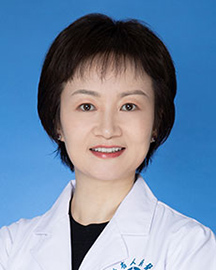

<!-- AUTO-GENERATED-BY: work/generate_obsidian_profiles.py -->

<!-- TEMPLATE: D:\workspace\信息收集整理\医生画像仓库\模板\医生画像模板.md -->

# 董晖

## 基础信息

| 字段 | 内容 |
|---|---|
| 姓名 | 董晖 |
| 医院 | 广东省人民医院 |
| 科室 | 检验科 |
| 职称/身份 | 副主任技师 |
| 来源链接 | [官网原文](https://www.gdghospital.org.cn/Expertlistt/info_itemid_25319_subjectid_60.html) |
| 采集日期 | 2026-08-14 |

## 简介/擅长

## 教育与进修经历

- 1993年毕业于四川大学华西医学院，本科学历。

## 科研项目与成果

- 从事生化和免疫检验工作三十年，曾任生化专业组组长，在产前筛查、内分泌、肿瘤、心脑血管、感染性疾病等领域的检验与临床应用方面以及实验室管理和标准化建设方面具有丰富的理论和实践经验。

## 可包装亮点

- 现任广东省卫生厅继续教育检验专家组成员、广东省优生优育协会专家委员会委员、广东省产前诊断技术专家库专家、广东省人民医院产前诊断中心生化免疫组组长、华南理工大学医学院兼职临床教师。
- 从事生化和免疫检验工作三十年，曾任生化专业组组长，在产前筛查、内分泌、肿瘤、心脑血管、感染性疾病等领域的检验与临床应用方面以及实验室管理和标准化建设方面具有丰富的理论和实践经验。

## 重点疾病/人群标签

- 慢性病：
- 肿瘤：肿瘤、免疫、感染
- 生殖疾病：
- 免疫/风湿：肿瘤、免疫、感染
- 术后恢复/康复：
- 疑难重症：

## 证据摘录

> 只摘录官网公开信息中的短句或关键字段，不复制大段原文。

- 官网身份字段：副主任技师
- 官网亮眼经历线索：现任广东省卫生厅继续教育检验专家组成员、广东省优生优育协会专家委员会委员、广东省产前诊断技术专家库专家、广东省人民医院产前诊断中心生化免疫组组长、华南理工大学医学院兼职临床教师。 从事生化和免疫检验工作三十年，曾任生化专业组组长，在产前筛查、内分泌、肿瘤、心脑血管、感染性疾病等领域的检验与临床应用方面以及实验室管理和标准化建设方面具有丰富的理论和实践经验。
- 来源链接：https://www.gdghospital.org.cn/Expertlistt/info_itemid_25319_subjectid_60.html

## BD 画像摘要

董晖医生可作为肿瘤、免疫/风湿/感染方向的基础画像候选。后续 BD 使用应继续以官网来源和人工复核为准，不添加疗效承诺或无来源包装。

## 合规边界

- 仅使用医院官网、官方公众号、官方小程序等公开渠道。
- 不采集私人电话、私人微信、家庭住址、患者隐私或非公开排班信息。
- 不写“保证治愈”“疗效第一”“包治疑难杂症”等无法由官网证明的表述。
