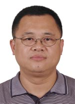

<!-- AUTO-GENERATED-BY: work/generate_obsidian_profiles.py -->

<!-- TEMPLATE: D:\workspace\信息收集整理\医生画像仓库\模板\医生画像模板.md -->

# 蒋文新

## 基础信息

| 字段 | 内容 |
|---|---|
| 姓名 | 蒋文新 |
| 医院 | 广东省人民医院 |
| 科室 | 重症医学科 |
| 职称/身份 | 主任医师 |
| 来源链接 | [官网原文](https://www.gdghospital.org.cn/Expertlistt/info_itemid_25439_subjectid_100.html) |
| 采集日期 | 2026-08-14 |

## 简介/擅长

各种危重症疑难病例与少见病例的诊治，尤其擅长机械通气的维护与综合治疗

## 教育与进修经历

- 急危重症医学部ICU一区行政主任 社会兼职 ： 广东省医师协会危重病医学医师分会常委兼秘书、中华医学会重症医学专科资质培训班培训教师 专业特长 ： 主要研究普通内外科、呼吸内科与危重病医学等专科问题，擅长各种危重症疑难病例与少见病例的诊治，尤其擅长机械通气的维护与综合治疗。

## 可包装亮点

- 急危重症医学部ICU一区行政主任 社会兼职 ： 广东省医师协会危重病医学医师分会常委兼秘书、中华医学会重症医学专科资质培训班培训教师 专业特长 ： 主要研究普通内外科、呼吸内科与危重病医学等专科问题，擅长各种危重症疑难病例与少见病例的诊治，尤其擅长机械通气的维护与综合治疗。

## 重点疾病/人群标签

- 慢性病：
- 肿瘤：
- 生殖疾病：
- 免疫/风湿：
- 术后恢复/康复：
- 疑难重症：疑难、危重、重症、急危重

## 证据摘录

> 只摘录官网公开信息中的短句或关键字段，不复制大段原文。

- 官网身份字段：主任医师
- 官网简介/擅长：各种危重症疑难病例与少见病例的诊治，尤其擅长机械通气的维护与综合治疗
- 官网亮眼经历线索：急危重症医学部ICU一区行政主任 社会兼职 ： 广东省医师协会危重病医学医师分会常委兼秘书、中华医学会重症医学专科资质培训班培训教师 专业特长 ： 主要研究普通内外科、呼吸内科与危重病医学等专科问题，擅长各种危重症疑难病例与少见病例的诊治，尤其擅长机械通气的维护与综合治疗。
- 来源链接：https://www.gdghospital.org.cn/Expertlistt/info_itemid_25439_subjectid_100.html

## BD 画像摘要

蒋文新医生可作为疑难重症方向的基础画像候选。后续 BD 使用应继续以官网来源和人工复核为准，不添加疗效承诺或无来源包装。

## 合规边界

- 仅使用医院官网、官方公众号、官方小程序等公开渠道。
- 不采集私人电话、私人微信、家庭住址、患者隐私或非公开排班信息。
- 不写“保证治愈”“疗效第一”“包治疑难杂症”等无法由官网证明的表述。
