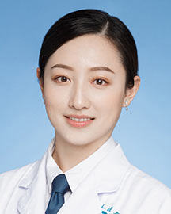

<!-- AUTO-GENERATED-BY: work/generate_obsidian_profiles.py -->

<!-- TEMPLATE: D:\workspace\信息收集整理\医生画像仓库\模板\医生画像模板.md -->

# 蓝剑青

## 基础信息

| 字段 | 内容 |
|---|---|
| 姓名 | 蓝剑青 |
| 医院 | 广东省人民医院 |
| 科室 | 眼科 |
| 职称/身份 | 主治医师 |
| 来源链接 | [官网原文](https://www.gdghospital.org.cn/Expertlistt/info_itemid_24988_subjectid_46.html) |
| 采集日期 | 2026-08-14 |

## 简介/擅长

熟练掌握各类常见及复杂眼病的诊疗

## 科研项目与成果

- 主持完成国家级、省 级科研课题4项，多项研究成果发表于 JAMA Ophthalmology、Frontiers in Neuroscience、Cyberpsychology, Behavior, and Social Networking、BMC Ophthalmology 等国际专业期刊。

## 论文与学术产出

- 主持完成国家级、省 级科研课题4项，多项研究成果发表于 JAMA Ophthalmology、Frontiers in Neuroscience、Cyberpsychology, Behavior, and Social Networking、BMC Ophthalmology 等国际专业期刊。

## 可包装亮点

- 核心专精于：① 个性化屈光矫正手术（全 飞秒SMILE、飞秒激光FS-LASIK、全激光LASEK、有晶体眼ICL植入等），为屈光 不正、高度近视、角膜条件特殊者设计个性化安全精准方案；
- 现任中国 女医师协会眼科专委会委员，广东省视光学会屈光手术专委会委员，广东省医师协 会屈光教育专委会委员，广东省医师协会近视防控专委会委员，广东省低视力康复 专业委员会委员，广东省眼健康协会白内障屈光专委会委员。
- 主持完成国家级、省 级科研课题4项，多项研究成果发表于 JAMA Ophthalmology、Frontiers in Neuroscience、Cyberpsychology, Behavior, and Social Networking、BMC Ophthalmology 等国际专业期刊。

## 重点疾病/人群标签

- 慢性病：
- 肿瘤：
- 生殖疾病：
- 免疫/风湿：
- 术后恢复/康复：术后、康复、复杂
- 疑难重症：术后、康复、复杂

## 证据摘录

> 只摘录官网公开信息中的短句或关键字段，不复制大段原文。

- 官网身份字段：主治医师
- 官网简介/擅长：熟练掌握各类常见及复杂眼病的诊疗
- 官网亮眼经历线索：核心专精于：① 个性化屈光矫正手术（全 飞秒SMILE、飞秒激光FS-LASIK、全激光LASEK、有晶体眼ICL植入等），为屈光 不正、高度近视、角膜条件特殊者设计个性化安全精准方案； 现任中国 女医师协会眼科专委会委员，广东省视光学会屈光手术专委会委员，广东省医师协 会屈光教育专委会委员，广东省医师协会近视防控专委会委员，广东省低视力康复 专业委员会委员，广东省眼健康协会白内障屈光专委会委员。 主持完成国家级、省 级科研课题4项…
- 来源链接：https://www.gdghospital.org.cn/Expertlistt/info_itemid_24988_subjectid_46.html

## BD 画像摘要

蓝剑青医生可作为术后恢复/康复、疑难重症方向的基础画像候选。后续 BD 使用应继续以官网来源和人工复核为准，不添加疗效承诺或无来源包装。

## 合规边界

- 仅使用医院官网、官方公众号、官方小程序等公开渠道。
- 不采集私人电话、私人微信、家庭住址、患者隐私或非公开排班信息。
- 不写“保证治愈”“疗效第一”“包治疑难杂症”等无法由官网证明的表述。
