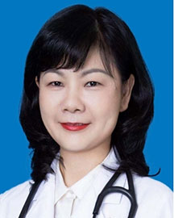

<!-- AUTO-GENERATED-BY: work/generate_obsidian_profiles.py -->

<!-- TEMPLATE: D:\workspace\信息收集整理\医生画像仓库\模板\医生画像模板.md -->

# 薛玉梅

## 基础信息

| 字段 | 内容 |
|---|---|
| 姓名 | 薛玉梅 |
| 医院 | 广东省人民医院 |
| 科室 | 心血管内科 |
| 职称/身份 | 主任医师 |
| 来源链接 | [官网原文](https://www.gdghospital.org.cn/Expertlistt/info_itemid_25473_subjectid_79.html) |
| 采集日期 | 2026-08-14 |

## 简介/擅长

房颤、复杂房性心动过速、各种室性心律失常的导管消融及起搏器治疗心动过缓、心衰再同步化治疗

## 教育与进修经历

- 现任国家卫健委心律失常介入培训基地导师、中国大湾区心脏协会心律失常分会副主任委员、中国生物医学工程学会心律学分会常务委员兼秘书长等。

## 可包装亮点

- 医学博士、博士生导师、心内科副主任 曾获中国医师协会颁发的导管消融技术推广奖、“羊城好医生”光荣称号。
- 曾赴德国、澳大利亚、美国的知名医学中心访问学习。
- 现任国家卫健委心律失常介入培训基地导师、中国大湾区心脏协会心律失常分会副主任委员、中国生物医学工程学会心律学分会常务委员兼秘书长等。

## 重点疾病/人群标签

- 慢性病：心衰、复杂
- 肿瘤：
- 生殖疾病：
- 免疫/风湿：
- 术后恢复/康复：
- 疑难重症：心衰、复杂

## 证据摘录

> 只摘录官网公开信息中的短句或关键字段，不复制大段原文。

- 官网身份字段：主任医师
- 官网简介/擅长：房颤、复杂房性心动过速、各种室性心律失常的导管消融及起搏器治疗心动过缓、心衰再同步化治疗
- 官网亮眼经历线索：医学博士、博士生导师、心内科副主任 曾获中国医师协会颁发的导管消融技术推广奖、“羊城好医生”光荣称号。 曾赴德国、澳大利亚、美国的知名医学中心访问学习。 现任国家卫健委心律失常介入培训基地导师、中国大湾区心脏协会心律失常分会副主任委员、中国生物医学工程学会心律学分会常务委员兼秘书长等。
- 来源链接：https://www.gdghospital.org.cn/Expertlistt/info_itemid_25473_subjectid_79.html

## BD 画像摘要

薛玉梅医生可作为慢性病、疑难重症方向的基础画像候选。后续 BD 使用应继续以官网来源和人工复核为准，不添加疗效承诺或无来源包装。

## 合规边界

- 仅使用医院官网、官方公众号、官方小程序等公开渠道。
- 不采集私人电话、私人微信、家庭住址、患者隐私或非公开排班信息。
- 不写“保证治愈”“疗效第一”“包治疑难杂症”等无法由官网证明的表述。
