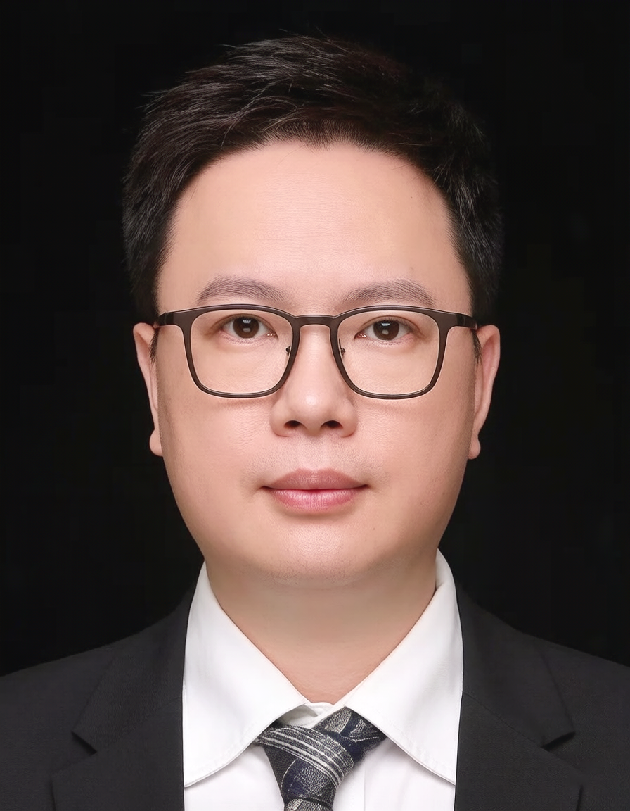

<!-- AUTO-GENERATED-BY: work/generate_obsidian_profiles.py -->

<!-- TEMPLATE: D:\workspace\信息收集整理\医生画像仓库\模板\医生画像模板.md -->

# 袁凯旋

## 基础信息

| 字段 | 内容 |
|---|---|
| 姓名 | 袁凯旋 |
| 医院 | 广东省人民医院 |
| 科室 | 检验科 |
| 职称/身份 | 主管技师 |
| 来源链接 | [官网原文](https://www.gdghospital.org.cn/Expertlistt/info_itemid_54408_subjectid_60.html) |
| 采集日期 | 2026-08-14 |

## 简介/擅长

深部真菌、医学藻类、寄生虫等感染相关病原学诊断，以第一作者/通讯作者发表本领域国内外论文二十余篇

## 论文与学术产出

- 专业方向为临床检验诊断学，擅长深部真菌、医学藻类、寄生虫等感染相关病原学诊断，以第一作者/通讯作者发表本领域国内外论文二十余篇。

## 可包装亮点

- 广东省人民医院检验科临床微生物组教学管理员 现任华南真菌感染精准诊疗与经济学研究联盟秘书长；
- 广东省药学会第一届临床微生物专家委员会委员；
- 广东省广州白云区医学会检验分会委员；
- 广东省卫生信息网络协会智慧检验分会委员。

## 重点疾病/人群标签

- 慢性病：
- 肿瘤：
- 生殖疾病：
- 免疫/风湿：
- 术后恢复/康复：
- 疑难重症：

## 证据摘录

> 只摘录官网公开信息中的短句或关键字段，不复制大段原文。

- 官网身份字段：主管技师
- 官网简介/擅长：深部真菌、医学藻类、寄生虫等感染相关病原学诊断，以第一作者/通讯作者发表本领域国内外论文二十余篇
- 官网亮眼经历线索：广东省人民医院检验科临床微生物组教学管理员 现任华南真菌感染精准诊疗与经济学研究联盟秘书长； 广东省药学会第一届临床微生物专家委员会委员； 广东省广州白云区医学会检验分会委员； 广东省卫生信息网络协会智慧检验分会委员。
- 异常提示：职称/身份需人工复核
- 来源链接：https://www.gdghospital.org.cn/Expertlistt/info_itemid_54408_subjectid_60.html

## BD 画像摘要

袁凯旋医生可作为广东省人民医院检验科的基础医生资料入库。当前重点方向以总底表标签为准，官网未展示的信息保持空白。

## 合规边界

- 仅使用医院官网、官方公众号、官方小程序等公开渠道。
- 不采集私人电话、私人微信、家庭住址、患者隐私或非公开排班信息。
- 不写“保证治愈”“疗效第一”“包治疑难杂症”等无法由官网证明的表述。
