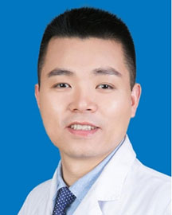

<!-- AUTO-GENERATED-BY: work/generate_obsidian_profiles.py -->

<!-- TEMPLATE: D:\workspace\信息收集整理\医生画像仓库\模板\医生画像模板.md -->

# 袁海云

## 基础信息

| 字段 | 内容 |
|---|---|
| 姓名 | 袁海云 |
| 医院 | 广东省人民医院 |
| 科室 | 心外科 |
| 职称/身份 | 主任医师 |
| 来源链接 | [官网原文](https://www.gdghospital.org.cn/Expertlistt/info_itemid_24368_subjectid_80.html) |
| 采集日期 | 2026-08-14 |

## 简介/擅长

微创小切口、完全胸腔镜以及经导管介入手术，为患者提供从微创小切口到全腔镜再到经导管介入的个体化微创治疗方案，是《全腔镜心脏外科手术》的参编专家

## 教育与进修经历

- 医学博士、博士后、博士生导师。

## 科研项目与成果

- 曾赴英国牛津大学和美国哈佛医学院波士顿儿童医院访学，担任南方医科大学、华南理工大学、汕头大学及广东省心血管病研究所的研究生导师，广东省华南结构性心脏病重点实验室副主任，广东省心血管质量控制中心秘书及广东省人民医院先心病产前产后一体化诊疗中心秘书。
- 广东省、浙江省和湖南省科研项目评审专家。
- 获得国家发明专利授权5项，实用新型专利3项。
- 主持完成省自然、市科技重大等科研课题共7项，获资助经费超150万。

## 论文与学术产出

- 专业方向为先天性心脏病的微创手术治疗，擅长微创小切口、完全胸腔镜以及经导管介入手术，为患者提供从微创小切口到全腔镜再到经导管介入的个体化微创治疗方案，是《全腔镜心脏外科手术》的参编专家。
- 研究方向为先天性心脏病的产前干预、部分心脏移植、右心室辅助和肺动脉高压的外科治疗，累计发表论文60余篇，其中SCI论文47篇。
- 参编出版心脏外科相关专著4部。

## 可包装亮点

- 医学博士、博士后、博士生导师。
- 曾赴英国牛津大学和美国哈佛医学院波士顿儿童医院访学，担任南方医科大学、华南理工大学、汕头大学及广东省心血管病研究所的研究生导师，广东省华南结构性心脏病重点实验室副主任，广东省心血管质量控制中心秘书及广东省人民医院先心病产前产后一体化诊疗中心秘书。
- 担任中国医师协会心血管外科分会前沿学组副组长、中国医师协会体外生命支持专业委员会青年委员、中国生物工程学会体外循环分会青年委员、广东省医学会心血管外科分会青年委员、广东省妇幼保健学会母婴心血管疾病防治专委会副主任委员、广东省生物工程学会胸心血管外科分会青年委员和广东省胸部疾病学会心血管外科专委会青年委员。
- 研究方向为先天性心脏病的产前干预、部分心脏移植、右心室辅助和肺动脉高压的外科治疗，累计发表论文60余篇，其中SCI论文47篇。

## 重点疾病/人群标签

- 慢性病：
- 肿瘤：
- 生殖疾病：
- 免疫/风湿：
- 术后恢复/康复：
- 疑难重症：

## 证据摘录

> 只摘录官网公开信息中的短句或关键字段，不复制大段原文。

- 官网身份字段：主任医师
- 官网简介/擅长：微创小切口、完全胸腔镜以及经导管介入手术，为患者提供从微创小切口到全腔镜再到经导管介入的个体化微创治疗方案，是《全腔镜心脏外科手术》的参编专家
- 官网亮眼经历线索：医学博士、博士后、博士生导师。 曾赴英国牛津大学和美国哈佛医学院波士顿儿童医院访学，担任南方医科大学、华南理工大学、汕头大学及广东省心血管病研究所的研究生导师，广东省华南结构性心脏病重点实验室副主任，广东省心血管质量控制中心秘书及广东省人民医院先心病产前产后一体化诊疗中心秘书。 担任中国医师协会心血管外科分会前沿学组副组长、中国医师协会体外生命支持专业委员会青年委员、中国生物工程学会体外循环分会青年委员、广东省医学会心血管外科分会青年…
- 来源链接：https://www.gdghospital.org.cn/Expertlistt/info_itemid_24368_subjectid_80.html

## BD 画像摘要

袁海云医生可作为广东省人民医院心外科的基础医生资料入库。当前重点方向以总底表标签为准，官网未展示的信息保持空白。

## 合规边界

- 仅使用医院官网、官方公众号、官方小程序等公开渠道。
- 不采集私人电话、私人微信、家庭住址、患者隐私或非公开排班信息。
- 不写“保证治愈”“疗效第一”“包治疑难杂症”等无法由官网证明的表述。
