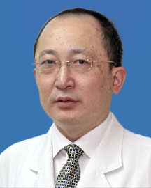

<!-- AUTO-GENERATED-BY: work/generate_obsidian_profiles.py -->

<!-- TEMPLATE: D:\workspace\信息收集整理\医生画像仓库\模板\医生画像模板.md -->

# 詹世强

## 基础信息

| 字段 | 内容 |
|---|---|
| 姓名 | 詹世强 |
| 医院 | 广东省人民医院 |
| 科室 | 脊柱外科 |
| 职称/身份 | 主任医师 |
| 来源链接 | [官网原文](https://www.gdghospital.org.cn/Expertlistt/info_itemid_24303_subjectid_48.html) |
| 采集日期 | 2026-08-14 |

## 简介/擅长

脊柱微创手术及脊柱畸形矫治，尤其擅长治疗脊柱侧弯、腰椎间盘突出、腰椎管狭窄症、腰椎滑脱、颈椎病、脊柱骨折、脊柱感染、脊柱肿瘤及骨质疏松

## 科研项目与成果

- 主持参与的省级立项课题8项，1项获中国人民武装警察部队科技进步二等奖, 参与编写专著1部。
- 2．广东省科技项目：棘突间非融合技术（Wallis）治疗首发腰椎间盘突出症的临床前瞻性对照研究，项目编号：2011B061300036 3．广东省科技项目：青少年特发性脊柱侧凸患者成肌细胞内褪黑素信号传导通路的研究，项目编号：2007B031506006 4．广东省医学科学技术研究项目：微创小切口手术在前路脊柱重建中的应用研究， 项目编号：A2007037 5．省卫生厅立项课题：同种异体T型框架骨加自体骨椎间嵌植治疗腰椎滑脱症 6．省卫生厅立项课题：脊柱侧凸诊疗技术规范和评估标准 主要论著 ： 1. 《Effic…

## 可包装亮点

- 硕士生导师 南方医科大学兼职教授 专业特长 ：从事脊柱外科临床工作三十多年。
- 率先在国内开展微创小切口脊柱重建、脊柱非融合技术及椎体成形术。
- 专家门诊 ：东川门诊周一上午232诊室，周四下午227诊室，周五上午232诊室 学术任职 ： 中国残疾人康复协会第四、五届肢残专业委员会 常务委员 中国矫形外科杂志第五届编委会 常务委员 中国医药协会骨科专业委员会 委员 广东省医师协会第一届脊柱外科专业委员会 副主任委员 广东省医师协会骨科分会第一、二届 副主任委员 广东省医师协会脊柱外科分会第一届 副主…

## 重点疾病/人群标签

- 慢性病：
- 肿瘤：肿瘤、感染、康复
- 生殖疾病：
- 免疫/风湿：肿瘤、感染、康复
- 术后恢复/康复：肿瘤、感染、康复
- 疑难重症：

## 证据摘录

> 只摘录官网公开信息中的短句或关键字段，不复制大段原文。

- 官网身份字段：主任医师
- 官网简介/擅长：脊柱微创手术及脊柱畸形矫治，尤其擅长治疗脊柱侧弯、腰椎间盘突出、腰椎管狭窄症、腰椎滑脱、颈椎病、脊柱骨折、脊柱感染、脊柱肿瘤及骨质疏松
- 官网亮眼经历线索：硕士生导师 南方医科大学兼职教授 专业特长 ：从事脊柱外科临床工作三十多年。 率先在国内开展微创小切口脊柱重建、脊柱非融合技术及椎体成形术。 专家门诊 ：东川门诊周一上午232诊室，周四下午227诊室，周五上午232诊室 学术任职 ： 中国残疾人康复协会第四、五届肢残专业委员会 常务委员 中国矫形外科杂志第五届编委会 常务委员 中国医药协会骨科专业委员会 委员 广东省医师协会第一届脊柱外科专业委员会 副主任委员 广东省医师协会骨科分会…
- 来源链接：https://www.gdghospital.org.cn/Expertlistt/info_itemid_24303_subjectid_48.html

## BD 画像摘要

詹世强医生可作为肿瘤、免疫/风湿/感染、术后恢复/康复方向的基础画像候选。后续 BD 使用应继续以官网来源和人工复核为准，不添加疗效承诺或无来源包装。

## 合规边界

- 仅使用医院官网、官方公众号、官方小程序等公开渠道。
- 不采集私人电话、私人微信、家庭住址、患者隐私或非公开排班信息。
- 不写“保证治愈”“疗效第一”“包治疑难杂症”等无法由官网证明的表述。
