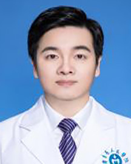

<!-- AUTO-GENERATED-BY: work/generate_obsidian_profiles.py -->

<!-- TEMPLATE: D:\workspace\信息收集整理\医生画像仓库\模板\医生画像模板.md -->

# 詹伟锋

## 基础信息

| 字段 | 内容 |
|---|---|
| 姓名 | 詹伟锋 |
| 医院 | 广东省人民医院 |
| 科室 | 急诊科 |
| 职称/身份 | 副主任医师 |
| 来源链接 | [官网原文](https://www.gdghospital.org.cn/Expertlistt/info_itemid_33769_subjectid_112.html) |
| 采集日期 | 2026-08-14 |

## 简介/擅长

掌握各种急危重症的诊治，熟悉CRRT、血流动力学监测、气管切开术、临时起搏器植入术等急救技能，尤其擅长重症感染性疾病的诊治，曾多长获得“医院个人先进工作者”及“先进共产党员”称号

## 教育与进修经历

- 广东省人民医院河源医院急诊科学科带头人 2002年毕业广州医科大学临床医学系，毕业后一直在广东省人民医院急危重症医学部工作，具有较丰富的临床、教学经验。

## 科研项目与成果

- 参与多个国家级多临床中心研究及省级课题，以第一作者在国内主流专业杂志发表多篇文章。

## 论文与学术产出

- 参与多个国家级多临床中心研究及省级课题，以第一作者在国内主流专业杂志发表多篇文章。

## 可包装亮点

- 广东省人民医院河源医院急诊科学科带头人 2002年毕业广州医科大学临床医学系，毕业后一直在广东省人民医院急危重症医学部工作，具有较丰富的临床、教学经验。
- 熟悉掌握各种急危重症的诊治，熟悉CRRT、血流动力学监测、气管切开术、临时起搏器植入术等急救技能，尤其擅长重症感染性疾病的诊治，曾多长获得“医院个人先进工作者”及“先进共产党员”称号。
- 参与多个国家级多临床中心研究及省级课题，以第一作者在国内主流专业杂志发表多篇文章。
- 中国中西医结合介入分会急诊专业委员会 常务理事 广东省精准毒物与中毒分会 常务委员 广东省预防医学会急症预防与急救专业委员会 委员 广东省精准医学应用学会分会 委员 广东省中西医结合学会急救医学专业委员会 委员 广东省医师协会分会（工作委员会）专业组 成员

## 重点疾病/人群标签

- 慢性病：
- 肿瘤：
- 生殖疾病：
- 免疫/风湿：
- 术后恢复/康复：
- 疑难重症：

## 证据摘录

> 只摘录官网公开信息中的短句或关键字段，不复制大段原文。

- 官网身份字段：副主任医师
- 官网简介/擅长：掌握各种急危重症的诊治，熟悉CRRT、血流动力学监测、气管切开术、临时起搏器植入术等急救技能，尤其擅长重症感染性疾病的诊治，曾多长获得“医院个人先进工作者”及“先进共产党员”称号
- 官网亮眼经历线索：广东省人民医院河源医院急诊科学科带头人 2002年毕业广州医科大学临床医学系，毕业后一直在广东省人民医院急危重症医学部工作，具有较丰富的临床、教学经验。 熟悉掌握各种急危重症的诊治，熟悉CRRT、血流动力学监测、气管切开术、临时起搏器植入术等急救技能，尤其擅长重症感染性疾病的诊治，曾多长获得“医院个人先进工作者”及“先进共产党员”称号。 参与多个国家级多临床中心研究及省级课题，以第一作者在国内主流专业杂志发表多篇文章。 中国中西医结合…
- 异常提示：同名待甄别
- 来源链接：https://www.gdghospital.org.cn/Expertlistt/info_itemid_33769_subjectid_112.html

## BD 画像摘要

詹伟锋医生可作为广东省人民医院急诊科的基础医生资料入库。当前重点方向以总底表标签为准，官网未展示的信息保持空白。

## 合规边界

- 仅使用医院官网、官方公众号、官方小程序等公开渠道。
- 不采集私人电话、私人微信、家庭住址、患者隐私或非公开排班信息。
- 不写“保证治愈”“疗效第一”“包治疑难杂症”等无法由官网证明的表述。
