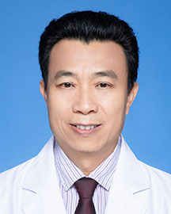

<!-- AUTO-GENERATED-BY: work/generate_obsidian_profiles.py -->

<!-- TEMPLATE: D:\workspace\信息收集整理\医生画像仓库\模板\医生画像模板.md -->

# 詹锋

## 基础信息

| 字段 | 内容 |
|---|---|
| 姓名 | 詹锋 |
| 医院 | 广东省人民医院 |
| 科室 | 中医内科 |
| 职称/身份 | 副主任医师 |
| 来源链接 | [官网原文](https://www.gdghospital.org.cn/Expertlistt/info_itemid_25408_subjectid_98.html) |
| 采集日期 | 2026-08-14 |

## 简介/擅长

## 教育与进修经历

- 中共党员，中西医结合副主任医师 学习经历 ：1990年毕业于广西医科大学；
- 1993-1996年在广州中医药大学脾胃研究所学习，获硕士学位；
- 2006-至今在广东省人民医院东病区（广东省老年病研究所）中医科工作，其中2011-2012年为德国杜伊斯堡-埃森大学访问学者；

## 科研项目与成果

- 科研情况 ：中药剂型改革（中药颗粒剂）的临床药效研究；

## 可包装亮点

- 中共党员，中西医结合副主任医师 学习经历 ：1990年毕业于广西医科大学；
- 2006-至今在广东省人民医院东病区（广东省老年病研究所）中医科工作，其中2011-2012年为德国杜伊斯堡-埃森大学访问学者；
- 学术任职 ：广东省中西医结合学会理事会理事（第5,6届）；
- 广东省中西医结合学会虚症与老年病专业委员会（第3,4,5届）常委，中青年工作委员会委员，脾胃消化病委员会委员；

## 重点疾病/人群标签

- 慢性病：高血压、慢性、癌
- 肿瘤：高血压、慢性、癌
- 生殖疾病：
- 免疫/风湿：
- 术后恢复/康复：
- 疑难重症：

## 证据摘录

> 只摘录官网公开信息中的短句或关键字段，不复制大段原文。

- 官网身份字段：副主任医师
- 官网亮眼经历线索：中共党员，中西医结合副主任医师 学习经历 ：1990年毕业于广西医科大学； 2006-至今在广东省人民医院东病区（广东省老年病研究所）中医科工作，其中2011-2012年为德国杜伊斯堡-埃森大学访问学者； 学术任职 ：广东省中西医结合学会理事会理事（第5,6届）； 广东省中西医结合学会虚症与老年病专业委员会（第3,4,5届）常委，中青年工作委员会委员，脾胃消化病委员会委员；
- 来源链接：https://www.gdghospital.org.cn/Expertlistt/info_itemid_25408_subjectid_98.html

## BD 画像摘要

詹锋医生可作为慢性病、肿瘤方向的基础画像候选。后续 BD 使用应继续以官网来源和人工复核为准，不添加疗效承诺或无来源包装。

## 合规边界

- 仅使用医院官网、官方公众号、官方小程序等公开渠道。
- 不采集私人电话、私人微信、家庭住址、患者隐私或非公开排班信息。
- 不写“保证治愈”“疗效第一”“包治疑难杂症”等无法由官网证明的表述。
