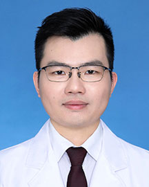

<!-- AUTO-GENERATED-BY: work/generate_obsidian_profiles.py -->

<!-- TEMPLATE: D:\workspace\信息收集整理\医生画像仓库\模板\医生画像模板.md -->

# 詹陆川

## 基础信息

| 字段 | 内容 |
|---|---|
| 姓名 | 詹陆川 |
| 医院 | 广东省人民医院 |
| 科室 | 药学部 |
| 职称/身份 | 副主任药师 |
| 来源链接 | [官网原文](https://www.gdghospital.org.cn/Expertlistt/info_itemid_70627_subjectid_68.html) |
| 采集日期 | 2026-08-14 |

## 简介/擅长

智慧医院评级工作，参与医院智慧药房及药学信息化建设，获得授权专利4项(成果转化1项）、团标及软著多项

## 科研项目与成果

- 熟悉智慧医院评级工作，参与医院智慧药房及药学信息化建设，获得授权专利4项(成果转化1项）、团标及软著多项。

## 论文与学术产出

- 社会任职 ： (1) 国家卫生健康委医院管理研究所药学信息青年专家委员会 副主任委员 (2) 中国药学会医药信息专业委员会 青年委员 (3) 核心期刊《医药导报》第十一届编委会青年编委 (4) 广东省药理学会药物警戒药品再评价专业委员会 委员 (5) 广东省药学会第九届药事管理专业委员会 委员 (6) 广东省药学会第七届医院药学专业委员会青年委员会 委员 (7) 广东省药学会第二届药物治疗管理专家委员会 委员

## 可包装亮点

- 熟悉智慧医院评级工作，参与医院智慧药房及药学信息化建设，获得授权专利4项(成果转化1项）、团标及软著多项。
- 社会任职 ： (1) 国家卫生健康委医院管理研究所药学信息青年专家委员会 副主任委员 (2) 中国药学会医药信息专业委员会 青年委员 (3) 核心期刊《医药导报》第十一届编委会青年编委 (4) 广东省药理学会药物警戒药品再评价专业委员会 委员 (5) 广东省药学会第九届药事管理专业委员会 委员 (6) 广东省药学会第七届医院药学专业委员会青年委员会 委员…

## 重点疾病/人群标签

- 慢性病：
- 肿瘤：
- 生殖疾病：
- 免疫/风湿：
- 术后恢复/康复：
- 疑难重症：

## 证据摘录

> 只摘录官网公开信息中的短句或关键字段，不复制大段原文。

- 官网身份字段：副主任药师
- 官网简介/擅长：智慧医院评级工作，参与医院智慧药房及药学信息化建设，获得授权专利4项(成果转化1项）、团标及软著多项
- 官网亮眼经历线索：熟悉智慧医院评级工作，参与医院智慧药房及药学信息化建设，获得授权专利4项(成果转化1项）、团标及软著多项。 社会任职 ： (1) 国家卫生健康委医院管理研究所药学信息青年专家委员会 副主任委员 (2) 中国药学会医药信息专业委员会 青年委员 (3) 核心期刊《医药导报》第十一届编委会青年编委 (4) 广东省药理学会药物警戒药品再评价专业委员会 委员 (5) 广东省药学会第九届药事管理专业委员会 委员 (6) 广东省药学会第七届医院药学…
- 来源链接：https://www.gdghospital.org.cn/Expertlistt/info_itemid_70627_subjectid_68.html

## BD 画像摘要

詹陆川医生可作为广东省人民医院药学部的基础医生资料入库。当前重点方向以总底表标签为准，官网未展示的信息保持空白。

## 合规边界

- 仅使用医院官网、官方公众号、官方小程序等公开渠道。
- 不采集私人电话、私人微信、家庭住址、患者隐私或非公开排班信息。
- 不写“保证治愈”“疗效第一”“包治疑难杂症”等无法由官网证明的表述。
