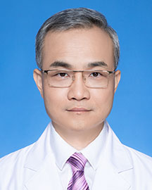

<!-- AUTO-GENERATED-BY: work/generate_obsidian_profiles.py -->

<!-- TEMPLATE: D:\workspace\信息收集整理\医生画像仓库\模板\医生画像模板.md -->

# 许刚

## 基础信息

| 字段 | 内容 |
|---|---|
| 姓名 | 许刚 |
| 医院 | 广东省人民医院 |
| 科室 | 心外科 |
| 职称/身份 | 主任医师 |
| 来源链接 | [官网原文](https://www.gdghospital.org.cn/Expertlistt/info_itemid_24348_subjectid_80.html) |
| 采集日期 | 2026-08-14 |

## 简介/擅长

各种小切口矫治常见先天性心脏病以及婴幼儿复杂先天性心脏病外科手术，如法乐氏四联症、全部及部分肺静脉异位引流、完全性房室通道、大动脉调转、肺动脉闭锁、婴幼儿主动脉弓疾病合并其他先天性心脏畸形的一期矫治、单心室Fontan类手术等等，从数量和质量上均达到国内先进水平

## 教育与进修经历

- 医学博士 毕业于中山大学。
- 1995年中山医科大学临床医学专业毕业，开始从事心脏病外科临床治疗和胸心外科的基础研究工作，尤其擅长各种小切口矫治常见先天性心脏病以及婴幼儿复杂先天性心脏病外科手术，如法乐氏四联症、全部及部分肺静脉异位引流、完全性房室通道、大动脉调转、肺动脉闭锁、婴幼儿主动脉弓疾病合并其他先天性心脏畸形的一期矫治、单心室Fontan类手术等等，从数量和质量上均达到国内先进水平。
- 曾到日本静冈儿童医院、美国芝加哥Advocate Hope Children’s Hospital和东田纳西州大学昆兰医学院进修学习。

## 科研项目与成果

- 作为项目负责人，完成广东省自然科学基金项目两项、广东省医学科学研究课题两项和广东省人民医院科学课题一项；
- 作为项目主要参加者，完成“十一五”、“十二五”国家科技支撑计划课题和国家自然科学基金课题各一项，一项广东省重点攻关课题，两项博士研究课题，数项硕士研究课题。

## 论文与学术产出

- 2009年获得中华医学会心胸血管外科分会授予的厄尔. 巴肯奖学金一等奖，在中华医学会心胸血管外科分会第9届、第17届全国会议上均获得优秀论文奖。

## 可包装亮点

- 担任广东省医学会心血管外科分会委员、中国孕产期母儿心脏病专业委员会委员。
- 曾到日本静冈儿童医院、美国芝加哥Advocate Hope Children’s Hospital和东田纳西州大学昆兰医学院进修学习。
- 2009年获得中华医学会心胸血管外科分会授予的厄尔. 巴肯奖学金一等奖，在中华医学会心胸血管外科分会第9届、第17届全国会议上均获得优秀论文奖。
- 作为主要完成人获广东省科技进步一等奖一项，广东省科技进步二等奖一项；

## 重点疾病/人群标签

- 慢性病：
- 肿瘤：
- 生殖疾病：
- 免疫/风湿：
- 术后恢复/康复：术后、康复、复杂
- 疑难重症：术后、康复、复杂

## 证据摘录

> 只摘录官网公开信息中的短句或关键字段，不复制大段原文。

- 官网身份字段：主任医师
- 官网简介/擅长：各种小切口矫治常见先天性心脏病以及婴幼儿复杂先天性心脏病外科手术，如法乐氏四联症、全部及部分肺静脉异位引流、完全性房室通道、大动脉调转、肺动脉闭锁、婴幼儿主动脉弓疾病合并其他先天性心脏畸形的一期矫治、单心室Fontan类手术等等，从数量和质量上均达到国内先进水平
- 官网亮眼经历线索：担任广东省医学会心血管外科分会委员、中国孕产期母儿心脏病专业委员会委员。 曾到日本静冈儿童医院、美国芝加哥Advocate Hope Children’s Hospital和东田纳西州大学昆兰医学院进修学习。 2009年获得中华医学会心胸血管外科分会授予的厄尔. 巴肯奖学金一等奖，在中华医学会心胸血管外科分会第9届、第17届全国会议上均获得优秀论文奖。 作为主要完成人获广东省科技进步一等奖一项，广东省科技进步二等奖一项；
- 来源链接：https://www.gdghospital.org.cn/Expertlistt/info_itemid_24348_subjectid_80.html

## BD 画像摘要

许刚医生可作为术后恢复/康复、疑难重症方向的基础画像候选。后续 BD 使用应继续以官网来源和人工复核为准，不添加疗效承诺或无来源包装。

## 合规边界

- 仅使用医院官网、官方公众号、官方小程序等公开渠道。
- 不采集私人电话、私人微信、家庭住址、患者隐私或非公开排班信息。
- 不写“保证治愈”“疗效第一”“包治疑难杂症”等无法由官网证明的表述。
