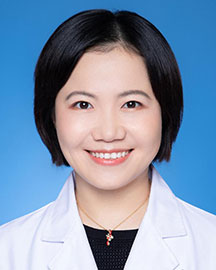

<!-- AUTO-GENERATED-BY: work/generate_obsidian_profiles.py -->

<!-- TEMPLATE: D:\workspace\信息收集整理\医生画像仓库\模板\医生画像模板.md -->

# 许咪咪

## 基础信息

| 字段 | 内容 |
|---|---|
| 姓名 | 许咪咪 |
| 医院 | 广东省人民医院 |
| 科室 | 咽喉头颈外科 |
| 职称/身份 | 副主任医师 |
| 来源链接 | [官网原文](https://www.gdghospital.org.cn/Expertlistt/info_itemid_58488_subjectid_45.html) |
| 采集日期 | 2026-08-14 |

## 简介/擅长

1.小儿头颈外科：头颈先天性疾病（各型鳃裂畸形、甲状舌管囊瘘、淋巴管畸形、皮样囊肿、表皮样囊肿、血管瘤、耳前瘘管、肌性斜颈等）、儿童头颈部腺体肿瘤的诊治等

## 可包装亮点

- 简介 医学硕士，副主任医师。
- 2024年在中华医学会第八届全国头颈外科年会、第十五届儿童耳鼻咽喉头颈外科学术会议中入围罕见病系列中青年手术视频展示。

## 重点疾病/人群标签

- 慢性病：
- 肿瘤：肿瘤、瘤、复杂、罕见
- 生殖疾病：
- 免疫/风湿：
- 术后恢复/康复：
- 疑难重症：肿瘤、瘤、复杂、罕见

## 证据摘录

> 只摘录官网公开信息中的短句或关键字段，不复制大段原文。

- 官网身份字段：副主任医师
- 官网简介/擅长：1.小儿头颈外科：头颈先天性疾病（各型鳃裂畸形、甲状舌管囊瘘、淋巴管畸形、皮样囊肿、表皮样囊肿、血管瘤、耳前瘘管、肌性斜颈等）、儿童头颈部腺体肿瘤的诊治等
- 官网亮眼经历线索：简介 医学硕士，副主任医师。 2024年在中华医学会第八届全国头颈外科年会、第十五届儿童耳鼻咽喉头颈外科学术会议中入围罕见病系列中青年手术视频展示。
- 来源链接：https://www.gdghospital.org.cn/Expertlistt/info_itemid_58488_subjectid_45.html

## BD 画像摘要

许咪咪医生可作为肿瘤、疑难重症方向的基础画像候选。后续 BD 使用应继续以官网来源和人工复核为准，不添加疗效承诺或无来源包装。

## 合规边界

- 仅使用医院官网、官方公众号、官方小程序等公开渠道。
- 不采集私人电话、私人微信、家庭住址、患者隐私或非公开排班信息。
- 不写“保证治愈”“疗效第一”“包治疑难杂症”等无法由官网证明的表述。
