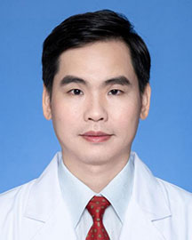

<!-- AUTO-GENERATED-BY: work/generate_obsidian_profiles.py -->

<!-- TEMPLATE: D:\workspace\信息收集整理\医生画像仓库\模板\医生画像模板.md -->

# 谢亮

## 基础信息

| 字段 | 内容 |
|---|---|
| 姓名 | 谢亮 |
| 医院 | 广东省人民医院 |
| 科室 | 胸外科 |
| 职称/身份 | 副主任医师 |
| 来源链接 | [官网原文](https://www.gdghospital.org.cn/Expertlistt/info_itemid_23165_subjectid_8.html) |
| 采集日期 | 2026-08-14 |

## 简介/擅长

胸部肿瘤综合治疗：擅长肺癌、食管癌、纵隔肿瘤手术为主的综合诊治，尤其对肺结节手术时机判断及三维重建精准治疗经验丰富

## 教育与进修经历

- 医学硕士，医院胸心住培基地教学主任，丹麦奥登赛大学医院访问学者。
- 简介 ： 2000年于中南大学湘雅医学院获硕士学位后，一直在广东省人民医院胸外科工作。
- 曾赴丹麦奥登赛大学医院进修微创胸腔镜技术（2009年），于北京儿童医院学习小儿胸外科及胸壁畸形矫治（2011年），并于台湾大学医院学习非插管肺手术及快速康复技术（2015年）。

## 科研项目与成果

- 主持广东省自然科学基金及广东省中医药局基金各1项，获实用新型专利2项。
- 科研方向聚焦于胸壁畸形与手汗症的临床研究，主持广东省自然科学基金项目《应用全外显子组测序技术筛选和鉴定先天性漏斗胸致病基因的研究》、广东省中医药局课题《玉屏风颗粒加减针刺治疗手汗症术后代偿性多汗的应用及机制研究》及吴阶平科研基金课题3项。
- 发表多篇学术论文，拥有发明专利，参编《实用临床胸外科学》、《肺神经内分泌癌》及医学研究生教材。
- 实用新型专利两项：《一种鸡胸矫正器磁吸自锁卡扣》、《一种胸腔镜下漏斗胸胸骨锯》。

## 论文与学术产出

- 曾获广州市第二届“实力中青年医生”称号、第十三届中华医学会胸心血管外科学年会青年优秀论文三等奖、全国肺癌免疫新辅助治疗病例演讲比赛一等奖。
- 发表学术论文近10篇，其中SCI 2篇，参编著作2部，并执笔中国首部《漏斗胸外科治疗专家共识》。
- 发表多篇学术论文，拥有发明专利，参编《实用临床胸外科学》、《肺神经内分泌癌》及医学研究生教材。

## 可包装亮点

- 医学硕士，医院胸心住培基地教学主任，丹麦奥登赛大学医院访问学者。
- 曾获广州市第二届“实力中青年医生”称号、第十三届中华医学会胸心血管外科学年会青年优秀论文三等奖、全国肺癌免疫新辅助治疗病例演讲比赛一等奖。
- 主持广东省自然科学基金及广东省中医药局基金各1项，获实用新型专利2项。
- 发表学术论文近10篇，其中SCI 2篇，参编著作2部，并执笔中国首部《漏斗胸外科治疗专家共识》。

## 重点疾病/人群标签

- 慢性病：
- 肿瘤：肿瘤、癌、肺癌、免疫、术后、康复、复杂
- 生殖疾病：
- 免疫/风湿：肿瘤、癌、肺癌、免疫、术后、康复、复杂
- 术后恢复/康复：肿瘤、癌、肺癌、免疫、术后、康复、复杂
- 疑难重症：肿瘤、癌、肺癌、免疫、术后、康复、复杂

## 证据摘录

> 只摘录官网公开信息中的短句或关键字段，不复制大段原文。

- 官网身份字段：副主任医师
- 官网简介/擅长：胸部肿瘤综合治疗：擅长肺癌、食管癌、纵隔肿瘤手术为主的综合诊治，尤其对肺结节手术时机判断及三维重建精准治疗经验丰富
- 官网亮眼经历线索：医学硕士，医院胸心住培基地教学主任，丹麦奥登赛大学医院访问学者。 曾获广州市第二届“实力中青年医生”称号、第十三届中华医学会胸心血管外科学年会青年优秀论文三等奖、全国肺癌免疫新辅助治疗病例演讲比赛一等奖。 主持广东省自然科学基金及广东省中医药局基金各1项，获实用新型专利2项。 发表学术论文近10篇，其中SCI 2篇，参编著作2部，并执笔中国首部《漏斗胸外科治疗专家共识》。
- 来源链接：https://www.gdghospital.org.cn/Expertlistt/info_itemid_23165_subjectid_8.html

## BD 画像摘要

谢亮医生可作为肿瘤、免疫/风湿/感染、术后恢复/康复、疑难重症方向的基础画像候选。后续 BD 使用应继续以官网来源和人工复核为准，不添加疗效承诺或无来源包装。

## 合规边界

- 仅使用医院官网、官方公众号、官方小程序等公开渠道。
- 不采集私人电话、私人微信、家庭住址、患者隐私或非公开排班信息。
- 不写“保证治愈”“疗效第一”“包治疑难杂症”等无法由官网证明的表述。
