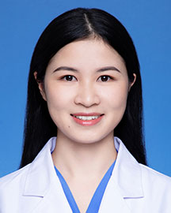

<!-- AUTO-GENERATED-BY: work/generate_obsidian_profiles.py -->

<!-- TEMPLATE: D:\workspace\信息收集整理\医生画像仓库\模板\医生画像模板.md -->

# 谢燕秋

## 基础信息

| 字段 | 内容 |
|---|---|
| 姓名 | 谢燕秋 |
| 医院 | 广东省人民医院 |
| 科室 | 生殖医学科 |
| 职称/身份 | 医师 |
| 来源链接 | [官网原文](https://www.gdghospital.org.cn/Expertlistt/info_itemid_34256_subjectid_53.html) |
| 采集日期 | 2026-08-14 |

## 简介/擅长

女性不孕症、多囊卵巢综合征、月经失调等的诊治，掌握人工授精、试管婴儿、卵巢功能评估等技术，提供备孕指导、孕前检查等生育咨询

## 教育与进修经历

- 毕业于中山大学，主要研究卵巢早衰、生育力保护、子宫内膜异位症等。

## 科研项目与成果

- 主持及参与课题6项，发表论文10篇。

## 论文与学术产出

- 主持及参与课题6项，发表论文10篇。

## 可包装亮点

- 现任广东省临床医学学会生殖医学分会青年委员会委员、广东省生殖健康科普联盟分委会委员。
- 主持及参与课题6项，发表论文10篇。

## 重点疾病/人群标签

- 慢性病：
- 肿瘤：
- 生殖疾病：生殖、不孕、卵巢、试管、多囊、月经
- 免疫/风湿：
- 术后恢复/康复：
- 疑难重症：

## 证据摘录

> 只摘录官网公开信息中的短句或关键字段，不复制大段原文。

- 官网身份字段：医师
- 官网简介/擅长：女性不孕症、多囊卵巢综合征、月经失调等的诊治，掌握人工授精、试管婴儿、卵巢功能评估等技术，提供备孕指导、孕前检查等生育咨询
- 官网亮眼经历线索：现任广东省临床医学学会生殖医学分会青年委员会委员、广东省生殖健康科普联盟分委会委员。 主持及参与课题6项，发表论文10篇。
- 来源链接：https://www.gdghospital.org.cn/Expertlistt/info_itemid_34256_subjectid_53.html

## BD 画像摘要

谢燕秋医生可作为生殖疾病方向的基础画像候选。后续 BD 使用应继续以官网来源和人工复核为准，不添加疗效承诺或无来源包装。

## 合规边界

- 仅使用医院官网、官方公众号、官方小程序等公开渠道。
- 不采集私人电话、私人微信、家庭住址、患者隐私或非公开排班信息。
- 不写“保证治愈”“疗效第一”“包治疑难杂症”等无法由官网证明的表述。
