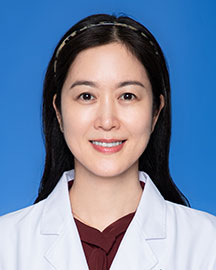

<!-- AUTO-GENERATED-BY: work/generate_obsidian_profiles.py -->

<!-- TEMPLATE: D:\workspace\信息收集整理\医生画像仓库\模板\医生画像模板.md -->

# 谢育梅

## 基础信息

| 字段 | 内容 |
|---|---|
| 姓名 | 谢育梅 |
| 医院 | 广东省人民医院 |
| 科室 | 心儿科 |
| 职称/身份 | 主任医师 |
| 来源链接 | [官网原文](https://www.gdghospital.org.cn/Expertlistt/info_itemid_24408_subjectid_81.html) |
| 采集日期 | 2026-08-14 |

## 简介/擅长

先天性心脏病的介入治疗、内外科的镶嵌治疗技术，在国内和亚太地区享有较高的声誉

## 教育与进修经历

- 德国柏林心脏中心访问学者。

## 科研项目与成果

- 科研业绩 ： 主要参与过国家“十五”和 “十一五”科技攻关项目和“十二五”科技支撑项目、国家重点研发计划，主持承担过广东省自然科学基金项目、广东省科技攻关项目及广东省卫生计生委科研基金项目等，致力于先天性心脏病介入治疗器械的改良与创新性研究，曾获广东省科技进步一等奖、第六届宋庆龄儿科医学奖、2024年上海市科技进步一等奖，多次获广东省人民医院新技术奖。

## 论文与学术产出

- 以第一作者及通讯作者在Biomaterials、 Catheter Cardiovascular Intervention、 Pediatric cardiology、Journal of Interventional Cardiology、Chinese Medical Journal、Reviews in Cardiovascular Medicine、中华心血管病杂志、中华胸心血管外科杂志、中华实用儿 科临床杂志、临床儿科杂志、心脏杂志、《心血管病学进展》等发表学术论文 40 余篇。

## 可包装亮点

- 德国柏林心脏中心访问学者。
- 学术兼职 ： 国家卫生健康委先心病介入治疗导师、美国先天性心脏病病介入治疗学会会员（FPICS）、中华医学会儿科学分会心血管学组先心病随访专业委员、中国医师协会儿科学分会晕厥专业委员、广东省介入性心脏病学会结构性心脏病分会主任委员、广东省健康管理学会儿童肿瘤相关心脏病专业委员会第一届委员会副主任委员、广东省医院协会心血管质控管理分会委员兼结构性心脏病学组副…
- 科研业绩 ： 主要参与过国家“十五”和 “十一五”科技攻关项目和“十二五”科技支撑项目、国家重点研发计划，主持承担过广东省自然科学基金项目、广东省科技攻关项目及广东省卫生计生委科研基金项目等，致力于先天性心脏病介入治疗器械的改良与创新性研究，曾获广东省科技进步一等奖、第六届宋庆龄儿科医学奖、2024年上海市科技进步一等奖，多次获广东省人民医院新技术奖。
- 以第一作者及通讯作者在Biomaterials、 Catheter Cardiova...

## 重点疾病/人群标签

- 慢性病：
- 肿瘤：肿瘤
- 生殖疾病：
- 免疫/风湿：
- 术后恢复/康复：
- 疑难重症：

## 证据摘录

> 只摘录官网公开信息中的短句或关键字段，不复制大段原文。

- 官网身份字段：主任医师
- 官网简介/擅长：先天性心脏病的介入治疗、内外科的镶嵌治疗技术，在国内和亚太地区享有较高的声誉
- 官网亮眼经历线索：德国柏林心脏中心访问学者。 学术兼职 ： 国家卫生健康委先心病介入治疗导师、美国先天性心脏病病介入治疗学会会员（FPICS）、中华医学会儿科学分会心血管学组先心病随访专业委员、中国医师协会儿科学分会晕厥专业委员、广东省介入性心脏病学会结构性心脏病分会主任委员、广东省健康管理学会儿童肿瘤相关心脏病专业委员会第一届委员会副主任委员、广东省医院协会心血管质控管理分会委员兼结构性心脏病学组副组长。 科研业绩 ： 主要参与过国家“十五”和 “十…
- 来源链接：https://www.gdghospital.org.cn/Expertlistt/info_itemid_24408_subjectid_81.html

## BD 画像摘要

谢育梅医生可作为肿瘤方向的基础画像候选。后续 BD 使用应继续以官网来源和人工复核为准，不添加疗效承诺或无来源包装。

## 合规边界

- 仅使用医院官网、官方公众号、官方小程序等公开渠道。
- 不采集私人电话、私人微信、家庭住址、患者隐私或非公开排班信息。
- 不写“保证治愈”“疗效第一”“包治疑难杂症”等无法由官网证明的表述。
