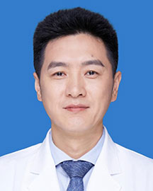

<!-- AUTO-GENERATED-BY: work/generate_obsidian_profiles.py -->

<!-- TEMPLATE: D:\workspace\信息收集整理\医生画像仓库\模板\医生画像模板.md -->

# 贲晓松

## 基础信息

| 字段 | 内容 |
|---|---|
| 姓名 | 贲晓松 |
| 医院 | 广东省人民医院 |
| 科室 | 胸外科 |
| 职称/身份 | 主任医师 |
| 来源链接 | [官网原文](https://www.gdghospital.org.cn/Expertlistt/info_itemid_23164_subjectid_8.html) |
| 采集日期 | 2026-08-14 |

## 简介/擅长

胸外科常见病以及终末期肺病肺移植的诊疗，擅长肺部结节的诊治、肺癌、食管癌和终末期肺病的多学科综合精准治疗，尤其擅长以单孔胸腔镜肺部微创手术为主的胸外科快速康复技术

## 科研项目与成果

- 学术专业领域成就 主持广州市产学研协同创新重大专项民生科技研究（资助经费200万元）一项，获专利多项，参加多中心临床研究多项，在国内外学术期刊发表论文多篇。

## 论文与学术产出

- 学术专业领域成就 主持广州市产学研协同创新重大专项民生科技研究（资助经费200万元）一项，获专利多项，参加多中心临床研究多项，在国内外学术期刊发表论文多篇。

## 可包装亮点

- 中共党员 胸外科行政副主任（主持工作） 外科学博士，主任医师，硕士生导师 主要社会兼职 1. 广东省医学教育协会胸部疾病专业委员会 主任委员 2. 广东省医师协会肿瘤外科医师分会 副主任委员 3. 广东省健康管理学会胸部肿瘤多学科协作专业委员会 副主任委员 4. 广东省药学会胸外科专家委员会 首届主任委员 5. 广东省医师协会胸外科医师分会 委员 6. 广…
- 学术专业领域成就 主持广州市产学研协同创新重大专项民生科技研究（资助经费200万元）一项，获专利多项，参加多中心临床研究多...

## 重点疾病/人群标签

- 慢性病：
- 肿瘤：肿瘤、癌、肺癌、康复、多学科
- 生殖疾病：
- 免疫/风湿：
- 术后恢复/康复：肿瘤、癌、肺癌、康复、多学科
- 疑难重症：肿瘤、癌、肺癌、康复、多学科

## 证据摘录

> 只摘录官网公开信息中的短句或关键字段，不复制大段原文。

- 官网身份字段：主任医师
- 官网简介/擅长：胸外科常见病以及终末期肺病肺移植的诊疗，擅长肺部结节的诊治、肺癌、食管癌和终末期肺病的多学科综合精准治疗，尤其擅长以单孔胸腔镜肺部微创手术为主的胸外科快速康复技术
- 官网亮眼经历线索：中共党员 胸外科行政副主任（主持工作） 外科学博士，主任医师，硕士生导师 主要社会兼职 1. 广东省医学教育协会胸部疾病专业委员会 主任委员 2. 广东省医师协会肿瘤外科医师分会 副主任委员 3. 广东省健康管理学会胸部肿瘤多学科协作专业委员会 副主任委员 4. 广东省药学会胸外科专家委员会 首届主任委员 5. 广东省医师协会胸外科医师分会 委员 6. 广东省医师协会器官移植医师分会 委员 7. 国际肺癌研究协会（IASLC） 会员…
- 来源链接：https://www.gdghospital.org.cn/Expertlistt/info_itemid_23164_subjectid_8.html

## BD 画像摘要

贲晓松医生可作为肿瘤、术后恢复/康复、疑难重症方向的基础画像候选。后续 BD 使用应继续以官网来源和人工复核为准，不添加疗效承诺或无来源包装。

## 合规边界

- 仅使用医院官网、官方公众号、官方小程序等公开渠道。
- 不采集私人电话、私人微信、家庭住址、患者隐私或非公开排班信息。
- 不写“保证治愈”“疗效第一”“包治疑难杂症”等无法由官网证明的表述。
