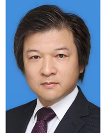

<!-- AUTO-GENERATED-BY: work/generate_obsidian_profiles.py -->

<!-- TEMPLATE: D:\workspace\信息收集整理\医生画像仓库\模板\医生画像模板.md -->

# 费继锋

## 基础信息

| 字段 | 内容 |
|---|---|
| 姓名 | 费继锋 |
| 医院 | 广东省人民医院 |
| 科室 | 病理科 |
| 职称/身份 | 研究员 |
| 来源链接 | [官网原文](https://www.gdghospital.org.cn/Expertlistt/info_itemid_33525_subjectid_59.html) |
| 采集日期 | 2026-08-14 |

## 简介/擅长

## 科研项目与成果

- 主持国家重点研发计划国际合作项目、国家重点研发计划子课题、基金委国家自然科学基金重大研究计划培育项目、面上项目等多项研究项目。

## 论文与学术产出

- Medicine Advances 杂志副主编；
- 目前以第一作者（共同第一作者）及通讯作者在 Nature、Science、Nature Protocols、Nature Communications、PLoS Biology、PNAS、Cell Reports、Stem Cell Reports等杂志发表研究论文。

## 可包装亮点

- 博士生导师 广东省珠江学者特聘教授；
- 广东省杰出青年医学人才；
- 中国细胞生物学学会青委会委员、发育分会委员；
- 中国细胞生物学学会黄浦研修班组委会成员；

## 重点疾病/人群标签

- 慢性病：
- 肿瘤：
- 生殖疾病：
- 免疫/风湿：
- 术后恢复/康复：
- 疑难重症：

## 证据摘录

> 只摘录官网公开信息中的短句或关键字段，不复制大段原文。

- 官网身份字段：研究员
- 官网亮眼经历线索：博士生导师 广东省珠江学者特聘教授； 广东省杰出青年医学人才； 中国细胞生物学学会青委会委员、发育分会委员； 中国细胞生物学学会黄浦研修班组委会成员；
- 来源链接：https://www.gdghospital.org.cn/Expertlistt/info_itemid_33525_subjectid_59.html

## BD 画像摘要

费继锋医生可作为广东省人民医院病理科的基础医生资料入库。当前重点方向以总底表标签为准，官网未展示的信息保持空白。

## 合规边界

- 仅使用医院官网、官方公众号、官方小程序等公开渠道。
- 不采集私人电话、私人微信、家庭住址、患者隐私或非公开排班信息。
- 不写“保证治愈”“疗效第一”“包治疑难杂症”等无法由官网证明的表述。
