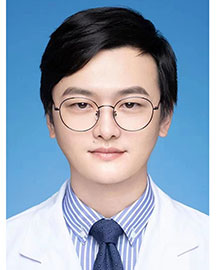

<!-- AUTO-GENERATED-BY: work/generate_obsidian_profiles.py -->

<!-- TEMPLATE: D:\workspace\信息收集整理\医生画像仓库\模板\医生画像模板.md -->

# 贾晓光

## 基础信息

| 字段 | 内容 |
|---|---|
| 姓名 | 贾晓光 |
| 医院 | 广东省人民医院 |
| 科室 | 口腔颌面外科 |
| 职称/身份 | 住院医师 |
| 来源链接 | [官网原文](https://www.gdghospital.org.cn/Expertlistt/info_itemid_34553_subjectid_86.html) |
| 采集日期 | 2026-08-14 |

## 简介/擅长

## 可包装亮点

- 教育履历： 德国罗斯托克大学 口腔医学 博士 俄罗斯圣彼得堡国立巴甫洛夫医科大学 口腔颌面外科 硕士 专业特长： 牙槽外科：复杂牙拔除术、牙种植术、颌骨植骨术等。

## 重点疾病/人群标签

- 慢性病：
- 肿瘤：肿瘤、复杂
- 生殖疾病：
- 免疫/风湿：
- 术后恢复/康复：
- 疑难重症：肿瘤、复杂

## 证据摘录

> 只摘录官网公开信息中的短句或关键字段，不复制大段原文。

- 官网身份字段：住院医师
- 官网亮眼经历线索：教育履历： 德国罗斯托克大学 口腔医学 博士 俄罗斯圣彼得堡国立巴甫洛夫医科大学 口腔颌面外科 硕士 专业特长： 牙槽外科：复杂牙拔除术、牙种植术、颌骨植骨术等。
- 来源链接：https://www.gdghospital.org.cn/Expertlistt/info_itemid_34553_subjectid_86.html

## BD 画像摘要

贾晓光医生可作为肿瘤、疑难重症方向的基础画像候选。后续 BD 使用应继续以官网来源和人工复核为准，不添加疗效承诺或无来源包装。

## 合规边界

- 仅使用医院官网、官方公众号、官方小程序等公开渠道。
- 不采集私人电话、私人微信、家庭住址、患者隐私或非公开排班信息。
- 不写“保证治愈”“疗效第一”“包治疑难杂症”等无法由官网证明的表述。
