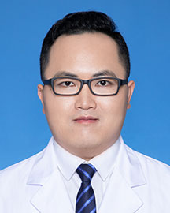

<!-- AUTO-GENERATED-BY: work/generate_obsidian_profiles.py -->

<!-- TEMPLATE: D:\workspace\信息收集整理\医生画像仓库\模板\医生画像模板.md -->

# 赖建国

## 基础信息

| 字段 | 内容 |
|---|---|
| 姓名 | 赖建国 |
| 医院 | 广东省人民医院 |
| 科室 | 乳腺科 |
| 职称/身份 | 副研究员 |
| 来源链接 | [官网原文](https://www.gdghospital.org.cn/Expertlistt/info_itemid_25363_subjectid_29.html) |
| 采集日期 | 2026-08-14 |

## 简介/擅长

擅长外科为主导的乳腺癌多学科综合治疗，乳腺癌化疗、内分泌治疗、生物靶向治 疗和免疫治疗等治疗

## 科研项目与成果

- 2023年获国家自然科学基金面上项目资助，2020年获国家自然科学基 金青年项目资助，2021年获广州市基础研究计划基础与应用基础研究项目资 助，2022年获广东省医学科研基金项目资助和2020年获广东省人民医院科技专项 基金资助。

## 论文与学术产出

- 在国外著名杂志以第一作者/通讯作者已发表20余篇SCI论文，其中IF大于5分共10 余篇。

## 可包装亮点

- 专长 擅长外科为主导的乳腺癌多学科综合治疗，乳腺癌化疗、内分泌治疗、生物靶向治 疗和免疫治疗等治疗。
- 2023年获国家自然科学基金面上项目资助，2020年获国家自然科学基 金青年项目资助，2021年获广州市基础研究计划基础与应用基础研究项目资 助，2022年获广东省医学科研基金项目资助和2020年获广东省人民医院科技专项 基金资助。
- 在国外著名杂志以第一作者/通讯作者已发表20余篇SCI论文，其中IF大于5分共10 余篇。
- 荣誉奖励 2023年10月,获CSCO“35under35”全国优秀青年肿瘤医生比赛“最佳人气奖”。

## 重点疾病/人群标签

- 慢性病：
- 肿瘤：肿瘤、化疗、靶向、乳腺癌、免疫、多学科
- 生殖疾病：
- 免疫/风湿：肿瘤、化疗、靶向、乳腺癌、免疫、多学科
- 术后恢复/康复：
- 疑难重症：肿瘤、化疗、靶向、乳腺癌、免疫、多学科

## 证据摘录

> 只摘录官网公开信息中的短句或关键字段，不复制大段原文。

- 官网身份字段：副研究员
- 官网简介/擅长：擅长外科为主导的乳腺癌多学科综合治疗，乳腺癌化疗、内分泌治疗、生物靶向治 疗和免疫治疗等治疗
- 官网亮眼经历线索：专长 擅长外科为主导的乳腺癌多学科综合治疗，乳腺癌化疗、内分泌治疗、生物靶向治 疗和免疫治疗等治疗。 2023年获国家自然科学基金面上项目资助，2020年获国家自然科学基 金青年项目资助，2021年获广州市基础研究计划基础与应用基础研究项目资 助，2022年获广东省医学科研基金项目资助和2020年获广东省人民医院科技专项 基金资助。 在国外著名杂志以第一作者/通讯作者已发表20余篇SCI论文，其中IF大于5分共10 余篇。 荣誉奖励…
- 来源链接：https://www.gdghospital.org.cn/Expertlistt/info_itemid_25363_subjectid_29.html

## BD 画像摘要

赖建国医生可作为肿瘤、免疫/风湿/感染、疑难重症方向的基础画像候选。后续 BD 使用应继续以官网来源和人工复核为准，不添加疗效承诺或无来源包装。

## 合规边界

- 仅使用医院官网、官方公众号、官方小程序等公开渠道。
- 不采集私人电话、私人微信、家庭住址、患者隐私或非公开排班信息。
- 不写“保证治愈”“疗效第一”“包治疑难杂症”等无法由官网证明的表述。
