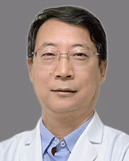

<!-- AUTO-GENERATED-BY: work/generate_obsidian_profiles.py -->

<!-- TEMPLATE: D:\workspace\信息收集整理\医生画像仓库\模板\医生画像模板.md -->

# 赵同峰

## 基础信息

| 字段 | 内容 |
|---|---|
| 姓名 | 赵同峰 |
| 医院 | 广东省人民医院 |
| 科室 | 老年内分泌科 |
| 职称/身份 | 主任医师 |
| 来源链接 | [官网原文](https://www.gdghospital.org.cn/Expertlistt/info_itemid_58508_subjectid_93.html) |
| 采集日期 | 2026-08-14 |

## 简介/擅长

领域 ：擅长糖尿病、甲状腺、肾上腺等内分泌及代谢性疾病的诊断和治疗，对糖尿病及动脉斑块的管理和逆转治疗有丰富的经验

## 教育与进修经历

- 博士，博士生导师，博士后指导教师 广东省人民医院老年内分泌科副主任（主持工作） 擅长领域 ：擅长糖尿病、甲状腺、肾上腺等内分泌及代谢性疾病的诊断和治疗，对糖尿病及动脉斑块的管理和逆转治疗有丰富的经验。

## 科研项目与成果

- 发表论文50多篇，主持及参加国家级、省部级等项目十余项，获国家发明专利2项，中华医学科技奖二等奖1项，参编教材2本，参加糖尿病预防与治疗标准制定1项。

## 论文与学术产出

- 发表论文50多篇，主持及参加国家级、省部级等项目十余项，获国家发明专利2项，中华医学科技奖二等奖1项，参编教材2本，参加糖尿病预防与治疗标准制定1项。

## 可包装亮点

- 博士，博士生导师，博士后指导教师 广东省人民医院老年内分泌科副主任（主持工作） 擅长领域 ：擅长糖尿病、甲状腺、肾上腺等内分泌及代谢性疾病的诊断和治疗，对糖尿病及动脉斑块的管理和逆转治疗有丰富的经验。
- 学会任职 ：中国老年保健学会糖胖病预防与管理专业委员会副主任委员；
- 中华医学会糖尿病学分会糖尿病中医药学组委员；
- 广东省医院协会糖尿病管理专业委员会副主任委员；

## 重点疾病/人群标签

- 慢性病：糖尿病、代谢
- 肿瘤：
- 生殖疾病：
- 免疫/风湿：
- 术后恢复/康复：
- 疑难重症：

## 证据摘录

> 只摘录官网公开信息中的短句或关键字段，不复制大段原文。

- 官网身份字段：主任医师
- 官网简介/擅长：领域 ：擅长糖尿病、甲状腺、肾上腺等内分泌及代谢性疾病的诊断和治疗，对糖尿病及动脉斑块的管理和逆转治疗有丰富的经验
- 官网亮眼经历线索：博士，博士生导师，博士后指导教师 广东省人民医院老年内分泌科副主任（主持工作） 擅长领域 ：擅长糖尿病、甲状腺、肾上腺等内分泌及代谢性疾病的诊断和治疗，对糖尿病及动脉斑块的管理和逆转治疗有丰富的经验。 学会任职 ：中国老年保健学会糖胖病预防与管理专业委员会副主任委员； 中华医学会糖尿病学分会糖尿病中医药学组委员； 广东省医院协会糖尿病管理专业委员会副主任委员；
- 来源链接：https://www.gdghospital.org.cn/Expertlistt/info_itemid_58508_subjectid_93.html

## BD 画像摘要

赵同峰医生可作为慢性病方向的基础画像候选。后续 BD 使用应继续以官网来源和人工复核为准，不添加疗效承诺或无来源包装。

## 合规边界

- 仅使用医院官网、官方公众号、官方小程序等公开渠道。
- 不采集私人电话、私人微信、家庭住址、患者隐私或非公开排班信息。
- 不写“保证治愈”“疗效第一”“包治疑难杂症”等无法由官网证明的表述。
