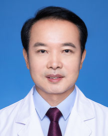

<!-- AUTO-GENERATED-BY: work/generate_obsidian_profiles.py -->

<!-- TEMPLATE: D:\workspace\信息收集整理\医生画像仓库\模板\医生画像模板.md -->

# 赵成利

## 基础信息

| 字段 | 内容 |
|---|---|
| 姓名 | 赵成利 |
| 医院 | 广东省人民医院 |
| 科室 | 整形外科 |
| 职称/身份 | 主任医师 |
| 来源链接 | [官网原文](https://www.gdghospital.org.cn/Expertlistt/info_itemid_32863_subjectid_117.html) |
| 采集日期 | 2026-08-14 |

## 简介/擅长

眼综合整形，头面部整形，鼻综合整形，注射微整形，面部年轻化手术，各种双眼皮美容失败病例的修复

## 教育与进修经历

- 曾于上海交通大学附属第九人民医院进修学习，多次在全国会议手术演示或发言。

## 可包装亮点

- 广东省医师协会整形与美容外科分会副主任委员，中华医学会整形外科分会眼整形学组委员，广东省精准医学会整形外科分会副主任委员，广东省医学教育学会整形外科分会副主任委员，广东省医学会医学美容学分会常委，广州市医疗事故签定小组成员。
- 曾于上海交通大学附属第九人民医院进修学习，多次在全国会议手术演示或发言。

## 重点疾病/人群标签

- 慢性病：
- 肿瘤：瘤
- 生殖疾病：
- 免疫/风湿：
- 术后恢复/康复：
- 疑难重症：

## 证据摘录

> 只摘录官网公开信息中的短句或关键字段，不复制大段原文。

- 官网身份字段：主任医师
- 官网简介/擅长：眼综合整形，头面部整形，鼻综合整形，注射微整形，面部年轻化手术，各种双眼皮美容失败病例的修复
- 官网亮眼经历线索：广东省医师协会整形与美容外科分会副主任委员，中华医学会整形外科分会眼整形学组委员，广东省精准医学会整形外科分会副主任委员，广东省医学教育学会整形外科分会副主任委员，广东省医学会医学美容学分会常委，广州市医疗事故签定小组成员。 曾于上海交通大学附属第九人民医院进修学习，多次在全国会议手术演示或发言。
- 来源链接：https://www.gdghospital.org.cn/Expertlistt/info_itemid_32863_subjectid_117.html

## BD 画像摘要

赵成利医生可作为肿瘤方向的基础画像候选。后续 BD 使用应继续以官网来源和人工复核为准，不添加疗效承诺或无来源包装。

## 合规边界

- 仅使用医院官网、官方公众号、官方小程序等公开渠道。
- 不采集私人电话、私人微信、家庭住址、患者隐私或非公开排班信息。
- 不写“保证治愈”“疗效第一”“包治疑难杂症”等无法由官网证明的表述。
