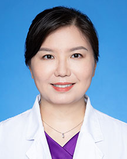

<!-- AUTO-GENERATED-BY: work/generate_obsidian_profiles.py -->

<!-- TEMPLATE: D:\workspace\信息收集整理\医生画像仓库\模板\医生画像模板.md -->

# 赵晓苗

## 基础信息

| 字段 | 内容 |
|---|---|
| 姓名 | 赵晓苗 |
| 医院 | 广东省人民医院 |
| 科室 | 生殖医学科 |
| 职称/身份 | 主任医师 |
| 来源链接 | [官网原文](https://www.gdghospital.org.cn/Expertlistt/info_itemid_33676_subjectid_53.html) |
| 采集日期 | 2026-08-14 |

## 简介/擅长

辅助生殖技术助孕（第一、二、三代试管婴儿，人工授精等），高龄和卵巢功能减退的女性助孕，反复着床失败，难治性复发性流产，子宫内膜薄，卵子发育

## 教育与进修经历

- 医学博士，博士导师，博士后合作导师，广东省自然科学基金杰出青年项目获得者，广东省杰出青年医学人才、广州实力中青年医生，中山大学青年教师重点培育项目获得者。

## 科研项目与成果

- 医学博士，博士导师，博士后合作导师，广东省自然科学基金杰出青年项目获得者，广东省杰出青年医学人才、广州实力中青年医生，中山大学青年教师重点培育项目获得者。
- 共主持3项国家自然、6项省部级科研基金、1项中山大学5010临床研究项目，主要负责（前3位）4项国家自然科学基金，参与包括国家重点研发计划和国家卫生部临床重点项目在内的多个项目研究。
- 2010国家科技进步奖二等奖、2017年国家妇幼健康技术奖二等奖、2019年广州市科技成果奖

## 论文与学术产出

- 兼任广东省保健协会生殖健康分会主任委员、中国康复医学会生殖健康专委会常委、中国妇幼保健协会辅助生殖技术监测与评估专业委员会副秘书长、中国医促会生殖医学专业委员会和中国预防医学会生殖医学专业委员会委员、中国医师协会生殖医学专业委员会青年委员，广东省生殖免疫学会生殖免疫学专委会委员和广州市医疗鉴定委员会委员以及多篇英文期刊审稿人等。
- 发表论著86篇，其中SCI论文42篇；

## 可包装亮点

- 医学博士，博士导师，博士后合作导师，广东省自然科学基金杰出青年项目获得者，广东省杰出青年医学人才、广州实力中青年医生，中山大学青年教师重点培育项目获得者。
- 美国UCLA (Cedars-Sinai medical center) 博士联合培养两年。
- 兼任广东省保健协会生殖健康分会主任委员、中国康复医学会生殖健康专委会常委、中国妇幼保健协会辅助生殖技术监测与评估专业委员会副秘书长、中国医促会生殖医学专业委员会和中国预防医学会生殖医学专业委员会委员、中国医师协会生殖医学专业委员会青年委员，广东省生殖免疫学会生殖免疫学专委会委员和广州市医疗鉴定委员会委员以及多篇英文期刊审稿人等。
- 共主持3项国家自然、6项省部级科研基金、1项中山大学5010临床研究项目，主要负责（前3位）4项国家自然科学基金，参与包括国家重点研发计划和国家卫生部临床重点项目在内的多个项目研究。

## 重点疾病/人群标签

- 慢性病：
- 肿瘤：
- 生殖疾病：生殖、卵巢、辅助生殖、试管、多囊、月经、免疫、康复、难治
- 免疫/风湿：生殖、卵巢、辅助生殖、试管、多囊、月经、免疫、康复、难治
- 术后恢复/康复：生殖、卵巢、辅助生殖、试管、多囊、月经、免疫、康复、难治
- 疑难重症：生殖、卵巢、辅助生殖、试管、多囊、月经、免疫、康复、难治

## 证据摘录

> 只摘录官网公开信息中的短句或关键字段，不复制大段原文。

- 官网身份字段：主任医师
- 官网简介/擅长：辅助生殖技术助孕（第一、二、三代试管婴儿，人工授精等），高龄和卵巢功能减退的女性助孕，反复着床失败，难治性复发性流产，子宫内膜薄，卵子发育
- 官网亮眼经历线索：医学博士，博士导师，博士后合作导师，广东省自然科学基金杰出青年项目获得者，广东省杰出青年医学人才、广州实力中青年医生，中山大学青年教师重点培育项目获得者。 美国UCLA (Cedars-Sinai medical center) 博士联合培养两年。 兼任广东省保健协会生殖健康分会主任委员、中国康复医学会生殖健康专委会常委、中国妇幼保健协会辅助生殖技术监测与评估专业委员会副秘书长、中国医促会生殖医学专业委员会和中国预防医学会生殖医学专业…
- 来源链接：https://www.gdghospital.org.cn/Expertlistt/info_itemid_33676_subjectid_53.html

## BD 画像摘要

赵晓苗医生可作为生殖疾病、免疫/风湿/感染、术后恢复/康复、疑难重症方向的基础画像候选。后续 BD 使用应继续以官网来源和人工复核为准，不添加疗效承诺或无来源包装。

## 合规边界

- 仅使用医院官网、官方公众号、官方小程序等公开渠道。
- 不采集私人电话、私人微信、家庭住址、患者隐私或非公开排班信息。
- 不写“保证治愈”“疗效第一”“包治疑难杂症”等无法由官网证明的表述。
