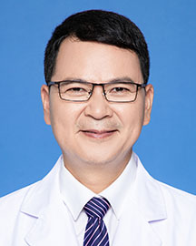

<!-- AUTO-GENERATED-BY: work/generate_obsidian_profiles.py -->

<!-- TEMPLATE: D:\workspace\信息收集整理\医生画像仓库\模板\医生画像模板.md -->

# 连环

## 基础信息

| 字段 | 内容 |
|---|---|
| 姓名 | 连环 |
| 医院 | 广东省人民医院 |
| 科室 | 老年心血管科 |
| 职称/身份 | 主治医师 |
| 来源链接 | [官网原文](https://www.gdghospital.org.cn/Expertlistt/info_itemid_25532_subjectid_94.html) |
| 采集日期 | 2026-08-14 |

## 简介/擅长

从事心血管疾病诊疗20余年，积累了丰富临床经验

## 教育与进修经历

- 履历 ： 主治医师，毕业于第一军医大学临床本科。

## 科研项目与成果

- 代表成果 ： 曾在中华医学杂志，岭南心血管病杂志，中国基层医药，实用医学杂志等核心杂志发表论文多篇，SCI论文一篇。

## 论文与学术产出

- 代表成果 ： 曾在中华医学杂志，岭南心血管病杂志，中国基层医药，实用医学杂志等核心杂志发表论文多篇，SCI论文一篇。

## 可包装亮点

- 擅长冠心病，心律失常、心力衰竭、心肌病、高血压等常见和疑难疾病诊治，特别擅长冠心病的诊治，对冠脉造影，冠脉支架植入术，冠脉血管内超声，冠脉血流分数测定，冠脉药物球囊植入，冠脉光学相干断层扫描，冠脉激光消融手术，肾动脉支架植入术等方面有较深造诣，年冠脉造影冠脉支架植入术近700台。
- 2014年取得卫生部冠脉介入准许证，2015年取得心血管内科副主任医师资格。
- 曾赴美国，英国，法国，意大利，澳大利亚，日本等国参加学术交流。
- 代表成果 ： 曾在中华医学杂志，岭南心血管病杂志，中国基层医药，实用医学杂志等核心杂志发表论文多篇，SCI论文一篇。

## 重点疾病/人群标签

- 慢性病：高血压、冠心病、心力衰竭、疑难
- 肿瘤：
- 生殖疾病：
- 免疫/风湿：
- 术后恢复/康复：
- 疑难重症：高血压、冠心病、心力衰竭、疑难

## 证据摘录

> 只摘录官网公开信息中的短句或关键字段，不复制大段原文。

- 官网身份字段：主治医师
- 官网简介/擅长：从事心血管疾病诊疗20余年，积累了丰富临床经验
- 官网亮眼经历线索：擅长冠心病，心律失常、心力衰竭、心肌病、高血压等常见和疑难疾病诊治，特别擅长冠心病的诊治，对冠脉造影，冠脉支架植入术，冠脉血管内超声，冠脉血流分数测定，冠脉药物球囊植入，冠脉光学相干断层扫描，冠脉激光消融手术，肾动脉支架植入术等方面有较深造诣，年冠脉造影冠脉支架植入术近700台。 2014年取得卫生部冠脉介入准许证，2015年取得心血管内科副主任医师资格。 曾赴美国，英国，法国，意大利，澳大利亚，日本等国参加学术交流。 代表成果 ：…
- 来源链接：https://www.gdghospital.org.cn/Expertlistt/info_itemid_25532_subjectid_94.html

## BD 画像摘要

连环医生可作为慢性病、疑难重症方向的基础画像候选。后续 BD 使用应继续以官网来源和人工复核为准，不添加疗效承诺或无来源包装。

## 合规边界

- 仅使用医院官网、官方公众号、官方小程序等公开渠道。
- 不采集私人电话、私人微信、家庭住址、患者隐私或非公开排班信息。
- 不写“保证治愈”“疗效第一”“包治疑难杂症”等无法由官网证明的表述。
